## PA3 穿越时空-批处理系统

读到这儿，首先恭喜你，也恭喜我自己成功打怪升级通关了PA1和PA2，来到了这里。前面是更艰辛的道路，千万不要放弃，坚持就会获得胜利。

### PA3.1 穿越时空的旅程：准备工作

#### 3.1.1 触发自陷操作

##### (1) 定义相关宏

> 首先是按照ISA的约定来设置异常入口地址, 将来切换执行流时才能跳转到正确的异常入口. 这显然是架构相关的行为, 因此我们把这一行为放入CTE中, 而不是让Nanos-lite直接来设置异常入口地址. 你需要在`nanos-lite/include/common.h`中定义宏`HAS_CTE`。

以上这一步的内容很明确。将对应位置的宏定义解注释即可。

##### (2) 实现`raise_intr()`函数

这个函数的实现仅仅看设置异常入口地址这一部分的手册可能会很迷茫。前文也要进行仔细阅读，手册没有哪一部分全是废话。

> riscv32提供`ecall`指令作为自陷指令, 并提供一个stvec寄存器来存放异常入口地址. 为了保存程序当前的状态, riscv32提供了一些特殊的系统寄存器, 叫控制状态寄存器(CSR寄存器). 在PA中, 我们只使用如下3个CSR寄存器:
>
> - sepc寄存器 - 存放触发异常的PC
> - sstatus寄存器 - 存放处理器的状态
> - scause寄存器 - 存放触发异常的原因
>
> riscv32触发异常后硬件的响应过程如下:
>
> 1. 将当前PC值保存到sepc寄存器
> 2. 在scause寄存器中设置异常号
> 3. 从stvec寄存器中取出异常入口地址
> 4. 跳转到异常入口地址

所以需要为`ISADecodeInfo`添加数据成员如下（在`nemu/src/isa/x86/include/isa/decode.h`）中：

```C
struct ISADecodeInfo {
  Instr instr;
  uint32_t stvec;
  uint32_t sepc, sstatus, scause;
};
```

然后是`raise_intr()`函数（在`nemu/src/isa/riscv32/intr.c`中）：

```C
#include "cpu/exec.h"
void raise_intr(uint32_t NO, vaddr_t epc) {
  decinfo.isa.sepc = epc;
  decinfo.isa.scause = NO;
  decinfo.jmp_pc = decinfo.isa.stvec;
  rtl_j(decinfo.jmp_pc);
}
```

##### (3) 实现系统调用指令

查表知系统调用指令通用一个opcode：1110011，据此填入`opcode_table`的对应位置：

```C
static OpcodeEntry opcode_table [32] = {
  /* b00 */ IDEX(ld, load), EMPTY, EMPTY, EMPTY, IDEX(I, Imm), IDEX(U, auipc), EMPTY, EMPTY,
  /* b01 */ IDEX(st, store), EMPTY, EMPTY, EMPTY, IDEX(R, Reg_2), IDEX(U, lui), EMPTY, EMPTY,
  /* b10 */ EMPTY, EMPTY, EMPTY, EMPTY, EMPTY, EMPTY, EMPTY, EMPTY,
  /* b11 */ IDEX(B, Branch), IDEX(I, jalr), EX(nemu_trap), IDEX(J, jal), IDEX(SYSTEM,syscall), EMPTY, EMPTY, EMPTY,
};
```

补充译码辅助函数（不要忘记头文件中的内容）：

```C
// pa3 added for system instructions
make_DHelper(SYSTEM)
{
  decode_op_r(id_src, decinfo.isa.instr.rs1, true);
  decode_op_i(id_src2, decinfo.isa.instr.csr, true);
  print_Dop(id_src->str, OP_STR_SIZE, "%d", decinfo.isa.instr.csr);
  decode_op_r(id_dest, decinfo.isa.instr.rd, false);
}
```

补充执行辅助函数。这里需要补充这些内容（下方图片参考了[RISC-V特权架构 - CSR寄存器_riscv csr寄存器-CSDN博客](https://blog.csdn.net/zyhse/article/details/136328840)）：

> #####   riscv32的特权模式简化
>
> 如果你RTFSC, 你会发现上述CSR寄存器都是S-mode(supervisor-mode, 监控者模式)的, 而标准的riscv32在开机后应该位于M-mode, 因此应该使用M-mode的CSR. 在这里我们选择S-mode, 是为了配合PA4的分页机制而进行的简化, 因此我们在NEMU中实现的并不是标准的riscv32(当然x86也不是), 不过这并不影响你的这些知识的理解. 如果你不理解这一段话的内容, 你可以忽略它.


所有的代码如下，清楚`csrr`等指令的作用的话应该不太难理解：

> 再给一个提示吧：`ecall`是有关系统调用方面的内容，如果你不是特别清楚，可以查看`navy-apps/libs/libos/src/nanos.c`和`nexus-am/am/include/arch/riscv32-nemu.h`，这样你就知道为什么要用

```C
#include "cpu/exec.h"

extern void raise_intr(uint32_t NO, vaddr_t epc);

int32_t readcsr(int i){
    switch(i){
        case 0x105:
            return decinfo.isa.stvec;
        case 0x142:
            return decinfo.isa.scause;
        case 0x100:
            return decinfo.isa.sstatus;
        case 0x141:
            return decinfo.isa.sepc;
        default:
            assert(0 && "Unfinished readcsr");
    }
}

void writecsr(int i, int32_t val){
    //TODO
    switch(i){
        case 0x105:
            decinfo.isa.stvec = val;
            break;
        case 0x142:
            decinfo.isa.scause = val;
            break;
        case 0x100:
            decinfo.isa.sstatus = val;
            break;
        case 0x141:
            decinfo.isa.sepc = val;
            break;
        default:
            assert(0 && "Unfinished readcsr");
    }
}

make_EHelper(syscall){
    Instr instr = decinfo.isa.instr;
    switch(instr.funct3){
        //ecall
        case 0b0:
            if((instr.val & ~(0x7f))==0){
                raise_intr(reg_l(17), decinfo.seq_pc-4);
            }
            else if(instr.val == 0x10200073){
                decinfo.jmp_pc = decinfo.isa.sepc + 4;
                rtl_j(decinfo.jmp_pc);
            }
            else{
                assert(0 && "system code unfinish");
            }
            break;
        // csrrw
        case 0b001:
            s0 = readcsr(instr.csr);
            writecsr(instr.csr, id_src->val);
            rtl_sr(id_dest->reg, &s0, 4);
            break;
        case 0b010:
            s0 = readcsr(instr.csr);
            writecsr(instr.csr, s0 | id_src->val);
            rtl_sr(id_dest->reg, &s0, 4);
            break;
        default:
            assert(0 && "Unfinished system op");
    }
}
```

结果：

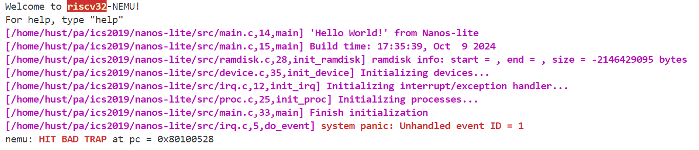

#### 3.1.2 保存上下文

首先是完成指令实现，这一部分上一小节已经搞定了。那么就剩下重新组织_Context结构体这个任务了。

> 理解上下文形成的过程并RTFSC, 然后重新组织`nexus-am/am/include/arch/$ISA-nemu.h` 中定义的`_Context`结构体的成员, 使得这些成员的定义顺序和 `nexus-am/am/src/$ISA/nemu/trap.S`中构造的上下文保持一致.

首先看`trap.S`的内容：

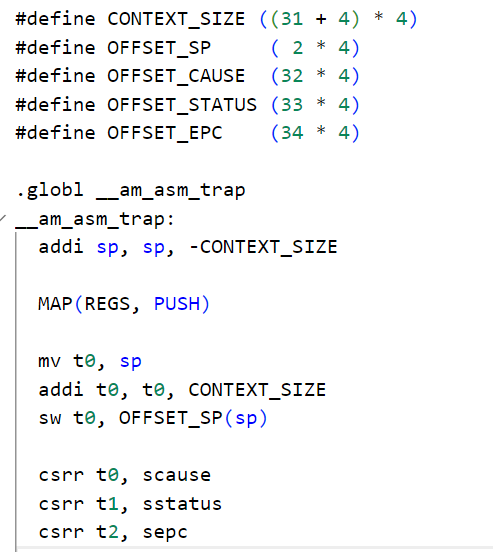

认真理解一下，不难得出顺序应当是下面这样的：

```C
struct _Context {
  uintptr_t gpr[32], cause, status, epc;
  struct _AddressSpace *as;
};
```

#### 3.1.3 事件分发

> #####  实现正确的事件分发
>
> 1. 在`__am_irq_handle()`中通过异常号识别出自陷异常, 并打包成编号为`_EVENT_YIELD`的自陷事件.
> 2. 在`do_event()`中识别出自陷事件`_EVENT_YIELD`, 然后输出一句话即可, 目前无需进行其它操作.

不难得到（这两个函数在`nexus-am/am/src/riscv32/nemu/cte.c`和`nanos-lite/src/irq.c`）：

```C
// __am_irq_handle()中添加的内容
    switch (c->cause) {
        // PA3 added for system instructions
        case -1:
            ev.event = _EVENT_YIELD;
            break;
```

```C
// do_event()中
  switch (e.event) {
    case _EVENT_YIELD: printf("Yield event happened!\n"); break;
```

#### 3.1.4 恢复上下文

> #####  恢复上下文
>
> 你需要实现这一过程中的新指令. 重新运行Nanos-lite, 如果你的实现正确, 你会看到在`do_event()`中输出的信息, 并且最后仍然触发了`main()`函数末尾设置的`panic()`.

这里其实要做的是完善之前的指令，幸运的是你已经完成了这一步。

### PA3.2 用于程序和系统调用

#### 3.2.1 加载第一个用户程序

> #####  实现loader
>
> 你需要在Nanos-lite中实现loader的功能, 来把用户程序加载到正确的内存位置, 然后执行用户程序. `loader()`函数在`nanos-lite/src/loader.c`中定义, 其中的`pcb`参数目前暂不使用, 可以忽略, 而因为`ramdisk`中目前只有一个文件, `filename`参数也可以忽略.
>
> 实现后, 在`init_proc()`中调用`naive_uload(NULL, NULL)`, 它会调用你实现的loader来加载第一个用户程序, 然后跳转到用户程序中执行. 如果你的实现正确, 你会看到执行`dummy`程序时在Nanos-lite中触发了一个未处理的1号事件. 这说明loader已经成功加载dummy, 并且成功地跳转到dummy中执行了. 关于未处理的事件, 我们会在下文进行说明.

`loader()`函数代码：

```C
static uintptr_t loader(PCB *pcb, const char *filename) {
  // TODO();
  // PA3.2 加载用户程序到正确位置
  Elf_Ehdr ehdr;
  ramdisk_read(&ehdr, 0, sizeof(Elf_Ehdr));
  assert((*(uint32_t *)ehdr.e_ident == 0x464c457f));

  Elf_Phdr phdr[ehdr.e_phnum];
  ramdisk_read(phdr, ehdr.e_phoff, sizeof(Elf_Phdr)*ehdr.e_phnum);
  for (int i = 0; i < ehdr.e_phnum; i++) {
    if (phdr[i].p_type == PT_LOAD) {
      ramdisk_read((void*)phdr[i].p_vaddr, phdr[i].p_offset, phdr[i].p_memsz);
      memset((void*)(phdr[i].p_vaddr+phdr[i].p_filesz), 0, phdr[i].p_memsz - phdr[i].p_filesz);
    }
  }
  return ehdr.e_entry;
}
```

正确完成实现后的情形：

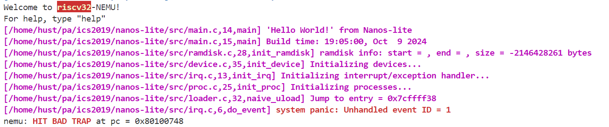

#### 3.2.2 系统调用

##### (1) 识别系统调用

> #####  识别系统调用
>
> 目前`dummy`已经通过`_syscall_()`直接触发系统调用, 你需要让Nanos-lite识别出系统调用事件`_EVENT_SYSCALL`.

`__am_irq_handle`函数补充内容：

```C

_Context* __am_irq_handle(_Context *c) {
  _Context *next = c;
  if (user_handler) {
    _Event ev = {0};
    // printf("c->cause: %d\n", c->cause);
    switch (c->cause) {
        // PA3 added for system instructions
        case -1:
            ev.event = _EVENT_YIELD;
            break;
        case 0:
        case 1:
            ev.event = _EVENT_SYSCALL;
            break;
        default: ev.event = _EVENT_ERROR; break;
    }
```

##### (2) 实现SYS_yield系统调用和SYS_exit系统调用

> ##### 实现SYS_yield系统调用
>
> 你需要:
>
> 1. 在`nexus-am/am/include/arch/$ISA-nemu.h`中实现正确的`GPR?`宏, 让它们从上下文`c`中获得正确的系统调用参数寄存器.
> 2. 添加`SYS_yield`系统调用.
> 3. 设置系统调用的返回值.
>
> 重新运行dummy程序, 如果你的实现正确, 你会看到dummy程序又触发了一个号码为`0`的系统调用. 查看`nanos-lite/src/syscall.h`, 你会发现它是一个`SYS_exit`系统调用. 这说明之前的`SYS_yield`已经成功返回, 触发`SYS_exit`是因为dummy已经执行完毕, 准备退出了.
>
> #####  实现SYS_exit系统调用
>
> 你需要实现`SYS_exit`系统调用, 它会接收一个退出状态的参数, 用这个参数调用`_halt()`即可. 实现成功后, 再次运行dummy程序, 你会看到`HIT GOOD TRAP`的信息.

看不懂要求没关系，慢慢来，先看手册这一段话：

> 添加一个系统调用比你想象中要简单, 所有信息都已经准备好了. 我们只需要在分发的过程中添加相应的系统调用号, 并编写相应的系统调用处理函数`sys_xxx()`, 然后调用它即可. 回过头来看`dummy`程序, 它触发了一个`SYS_yield`系统调用. 我们约定, 这个系统调用直接调用CTE的`_yield()`即可, 然后返回`0`.
>
> 处理系统调用的最后一件事就是设置系统调用的返回值. 对于不同的ISA, 系统调用的返回值存放在不同的寄存器中, 宏`GPRx`用于实现这一抽象, 所以我们通过`GPRx`来进行设置系统调用返回值即可.
>
> 经过CTE, 执行流会从`do_syscall()`一路返回到用户程序的`_syscall_()`函数中. 代码最后会从相应寄存器中取出系统调用的返回值, 并返回给`_syscall_()`的调用者, 告知其系统调用执行的情况(如是否成功等).

通过以上内容，我们就不难写出如下内容（关于参数和返回值的相关信息可以看下面关于`GPR?`的相关说明）：

```C
#include "common.h"
#include "syscall.h"

void sys_yield();
void sys_exit(int code);

_Context* do_syscall(_Context *c) {
  uintptr_t a[4];
  a[0] = c->GPR1;
  a[1] = c->GPR2;
  a[2] = c->GPR3;
  a[3] = c->GPR4;


  switch (a[0]) {
    case SYS_yield:
      sys_yield();
      c->GPRx = 0;
      break;
    case SYS_exit:
      sys_exit(a[1]);
      break;
    default: panic("Unhandled syscall ID = %d", a[0]);
  }

  return NULL;
}

void sys_yield() {
  _yield();
}

void sys_exit(int code) {
  _halt(code);
}
```

正确的`GPR?`宏：观察`_syscall_`的代码，发现是从`a0`寄存器取得系统调用的返回结果，因此修改`GPRx`的宏定义，将其改成寄存器`a0`的下标，就可以在操作系统中通过`c->GPRx`根据实际情况设置返回值了。想必你还记得下图，易知`a0`就是`gpr[10]`。然后GPR1是已经使用了，这个和前文也有联系；GPR2-4则是设置成通用寄存器后面来使用；GPRx作为返回值来使用。

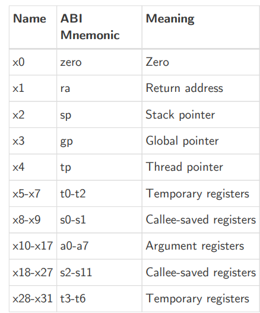

```C
#define GPR1 gpr[17]
#define GPR2 gpr[10]
#define GPR3 gpr[11]
#define GPR4 gpr[12]
#define GPRx gpr[10]
```

##### (3) 测试输出

完成！

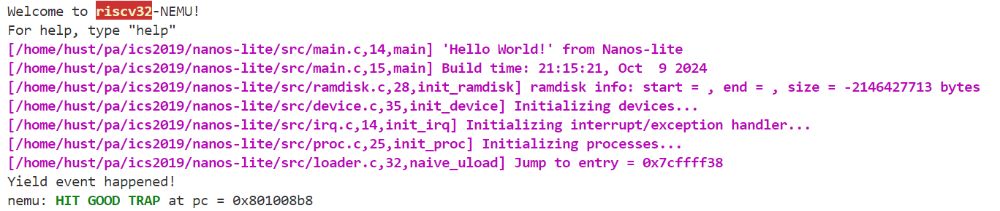

#### 3.2.3 标准输出

> ##### 在Nanos-lite上运行Hello world
>
> Navy-apps中提供了一个`hello`测试程序(`navy-apps/tests/hello`), 它首先通过`write()`来输出一句话, 然后通过`printf()`来不断输出.你需要实现`write()`系统调用, 然后把Nanos-lite上运行的用户程序切换成`hello`程序并运行

RTFM，知道我们需要完成`write()`系统调用。那么就是基本和前文一样的步骤补充。如下（截取了该部分补充的内容，其余省去）：

```C
#include "common.h"
#include "syscall.h"

int sys_write(int fd, void *buf, size_t count);

_Context* do_syscall(_Context *c) {
  switch (a[0]) {
    case SYS_write:
      c->GPRx = sys_write(a[1], (void*)(a[2]), a[3]);
      break;
  }
  return NULL;
}

int sys_write(int fd, void *buf, size_t count) {
  if(fd == 1 || fd == 2) {
    for(int i = 0; i < count; i++) {
      _putc(((char*)buf)[i]);
    }
    return count;
  }
  return 0;
}
```

然后是修改`nano.c`函数调用：

```C
int _write(int fd, void *buf, size_t count) {
  // _exit(SYS_write);
  // return 0;
  return _syscall_(SYS_write, fd, (intptr_t)buf, count);
}
```

> 修改`nanos-lite/Makefile`中`ramdisk`的生成规则, 把`ramdisk`中的唯一的文件换成hello程序:
>
> 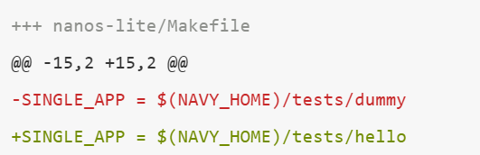

测试之前，不要忘记上面这句话！测试结果如下：

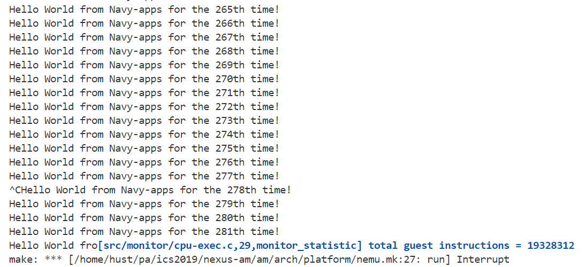

完成！

#### 3.2.4 堆区管理

> ##### 实现堆区管理
>
> 根据上述内容在Nanos-lite中实现`SYS_brk`系统调用, 然后在用户层实现`_sbrk()`. 

实现`SYS_brk`系统调用:

```C
#include "common.h"
#include "syscall.h"
int sys_brk(intptr_t addr);
static int program_break;
_Context* do_syscall(_Context *c) {
  switch (a[0]) {
    case SYS_brk:
      c->GPRx = sys_brk(a[1]);
      break;
    default: panic("Unhandled syscall ID = %d", a[0]);
  }
  return NULL;
}
int sys_brk(intptr_t addr) {
  program_break = addr;
  return 0;
}
```

在用户层实现`_sbrk()`（即在`nano.c`中）:

```
extern uint32_t _end;
void *_sbrk(intptr_t increment) {
  static int program_break = &_end;
  int ret = program_break;
  if(!_syscall_(SYS_brk, program_break + increment, 0, 0)){
    program_break += increment;
    return (void *)ret;
  }
  return (void *)-1;
}
```

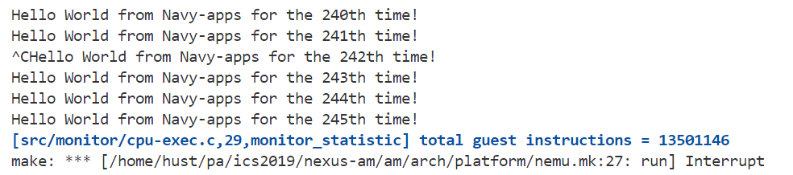

PA3.2完成！

> 进行一个补充：写的过程中，`__am_irq_handle`的SYSCALL部分的case是在逐步增加的，因为写的过程中逐步发现对应的cause分别是什么，所以如果你先看到了成品代码，也许会不太理解。粘贴一个完成了PA3.2部分后该函数的情况供参考：
>
> ```C
> _Context* __am_irq_handle(_Context *c) {
>     _Context *next = c;
>     if (user_handler) {
>        _Event ev = {0};
>        // printf("c->cause: %d\n", c->cause);
>        switch (c->cause) {
>            // PA3 added for system instructions
>            case -1:
>                ev.event = _EVENT_YIELD;
>                break;
>            case 0: // exit
>            case 1: // yield
>            case 4: // write
>            case 9: // sbrk
>                ev.event = _EVENT_SYSCALL;
>                break;
>            default: ev.event = _EVENT_ERROR; break;
>        }
> 
>        next = user_handler(ev, c);
>        if (next == NULL) {
>          next = c;
>        }
>     }
>   return next;
>   }
> ```
> 

### PA3.3 文件系统

#### 3.3.1 简易文件系统

首先修改`nanos-lite/Makefile`：

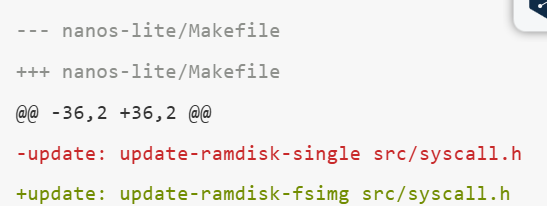

还需要为每一个已经打开的文件引入偏移量属性`open_offset`, 来记录目前文件操作的位置. 每次对文件读写了多少个字节, 偏移量就前进多少（这个结构体的定义也在`fs.c`中）：

```C
typedef struct {
  char *name;
  size_t size;
  size_t disk_offset; // 文件在ramdisk中的偏移
  // PA3.3 added
  size_t open_offset; // 文件被打开之后的读写指针
  ReadFn read;
  WriteFn write;
} Finfo;
```

然后仔细RTFM，我们知道我们需要在`fs.c`中实现以下函数（最好是把它们的声明放在头文件中，这样会更清晰一些）：

```C
int fs_open(const char *pathname, int flags, int mode);
size_t fs_read(int fd, void *buf, size_t len);
size_t fs_write(int fd, const void *buf, size_t len);
size_t fs_lseek(int fd, size_t offset, int whence);
int fs_close(int fd);
```

实现它们的时候要注意以下内容：

> - 由于简易文件系统中每一个文件都是固定的, 不会产生新文件, 因此"`fs_open()`没有找到`pathname`所指示的文件"属于异常情况, 你需要使用assertion终止程序运行.
> - 为了简化实现, 我们允许所有用户程序都可以对所有已存在的文件进行读写, 这样以后, 我们在实现`fs_open()`的时候就可以忽略`flags`和`mode`了.
> - 使用`ramdisk_read()`和`ramdisk_write()`来进行文件的真正读写.
> - 由于文件的大小是固定的, 在实现`fs_read()`, `fs_write()`和`fs_lseek()`的时候, 注意偏移量不要越过文件的边界.
> - 除了写入`stdout`和`stderr`之外(用`_putc()`输出到串口), 其余对于`stdin`, `stdout`和`stderr`这三个特殊文件的操作可以直接忽略.
> - 由于我们的简易文件系统没有维护文件打开的状态, `fs_close()`可以直接返回`0`, 表示总是关闭成功.

接下来就是具体的代码了：

```C
// PA3.3 added
extern size_t ramdisk_read(void*, size_t, size_t);          // for fs_read
extern size_t ramdisk_write(const void*, size_t, size_t);   // for fs_write

// PA3.3 updated
int fs_open(const char *pathname, int flags, int mode){
  // printf("open %s\n", pathname);
  for(int i = 0; i < NR_FILES;i++){
    if(strcmp(pathname, file_table[i].name) == 0){
        // printf("open %s OK\n", pathname);
        return i;
    }
  }
  assert(0 && "Can't find file");
}

size_t fs_read(int fd, void *buf, size_t len) {  
//   printf("open_offset = %d, disk_offset = %d\n", file_table[fd].open_offset, file_table[fd].disk_offset);
  assert(fd >= 3 && fd < NR_FILES);
  if (file_table[fd].open_offset + len >= file_table[fd].size) {
    if (file_table[fd].size > file_table[fd].open_offset)
      len = file_table[fd].size - file_table[fd].open_offset;
    else
      len = 0;
  }
//   printf("read %d bytes\n", len);
  if (!file_table[fd].read) {
    ramdisk_read(buf, file_table[fd].disk_offset + file_table[fd].open_offset, len);
  }
  else {
    len = file_table[fd].read(buf, file_table[fd].disk_offset + file_table[fd].open_offset, len);
  }
  file_table[fd].open_offset += len;
//   printf("open_offset = %d, disk_offset = %d\n", file_table[fd].open_offset, file_table[fd].disk_offset);
  return len;
}

size_t fs_write(int fd, const void *buf, size_t len) {
  // printf("open_offset = %d, disk_offset = %d\n", file_table[fd].open_offset, file_table[fd].disk_offset);
  if(fd == 1 || fd == 2) {
    for(int i = 0; i < len; i++) {
      _putc(((char*)buf)[i]);
    }
    return len;
  }
  if (fd >= 3 && (file_table[fd].open_offset + len > file_table[fd].size)) {
    if (file_table[fd].size > file_table[fd].open_offset)
      len = file_table[fd].size - file_table[fd].open_offset;
    else
      len = 0;
  }
  // printf("write %d bytes\n", len);
  if (!file_table[fd].write) {
    ramdisk_write(buf, file_table[fd].disk_offset + file_table[fd].open_offset, len);
  }
  else {
    file_table[fd].write(buf, file_table[fd].disk_offset + file_table[fd].open_offset, len);
  }
  file_table[fd].open_offset += len;
  return len;
}

size_t fs_lseek(int fd, size_t offset, int whence) {
  // printf("lseek %d %d %d\n", fd, offset, whence);
  assert(fd >= 3 && fd < NR_FILES);
  switch(whence) {
    case SEEK_SET: file_table[fd].open_offset = offset; break;
    case SEEK_CUR: file_table[fd].open_offset += offset; break;
    case SEEK_END: file_table[fd].open_offset = file_table[fd].size + offset; break;
    default: assert(0 && "Invalid whence");
  }
  return file_table[fd].open_offset;
}

int fs_close(int fd){
    file_table[fd].open_offset = 0;
    return 0;
}
```

除了完成`fs.c`之外，我们还需要另外去实现`SYS_open`,`SYS_close`,`SYS_read`,`SYS_lseek`系统调用，并将`SYS_write`系统调用更新为调用`fs_write()`函数。

`__am_irq_handle()`：

```C
_Context* __am_irq_handle(_Context *c) {
  if (user_handler) {
    switch (c->cause) {
        // PA3 added for system instructions
        case 0: // exit
        case 1: // yield
        case 2: // open
        case 3: // read
        case 4: // write
        case 7: // close
        case 8: // lseek
        case 9: // sbrk
            ev.event = _EVENT_SYSCALL;
            break;
    }
  }
}
```

`nanos-lite/src/syscall.c`相关函数：

```C
#include "common.h"
#include "fs.h"
#include "syscall.h"

int sys_write(int fd, void *buf, size_t count);
// PA3.3 updated
int sys_open(const char *pathname, int flags, int mode);
int sys_read(int fd, void *buf, size_t count);
int sys_lseek(int fd, size_t offset, int whence);
int sys_close(int fd);

static int program_break;

_Context* do_syscall(_Context *c) {
  uintptr_t a[4];
    
  switch (a[0]) {
    case SYS_write:
      c->GPRx = sys_write(a[1], (void*)(a[2]), a[3]);
      break;
    case SYS_open:
      c->GPRx = sys_open((const char*)a[1], a[2], a[3]);
      break;
    case SYS_read:
      c->GPRx = sys_read(a[1], (void*)(a[2]), a[3]);
      break;
    case SYS_lseek:
      c->GPRx = sys_lseek(a[1], a[2], a[3]);
      break;
    case SYS_close:
      c->GPRx = sys_close(a[1]);
      break;
    default: panic("Unhandled syscall ID = %d", a[0]);
  }
  return NULL;
}

int sys_write(int fd, void *buf, size_t count) {
  // if(fd == 1 || fd == 2) {
  //   for(int i = 0; i < count; i++) {
  //     _putc(((char*)buf)[i]);
  //   }
  //   return count;
  // }
  // return 0;
  return fs_write(fd, buf, count);
}

int sys_open(const char *pathname, int flags, int mode) {
  return fs_open(pathname, flags, mode);
}

int sys_read(int fd, void *buf, size_t count) {
  return fs_read(fd, buf, count);
}

int sys_lseek(int fd, size_t offset, int whence) {
  return fs_lseek(fd, offset, whence);
}

int sys_close(int fd) {
  return fs_close(fd);
}
```

更新`loader()`函数：

```C
#include "fs.h"
static uintptr_t loader(PCB *pcb, const char *filename) {
  // PA3.3 updated: use fs_read instead of ramdisk_read
  Elf_Ehdr head;
  int fd = fs_open(filename, 0, 0);

  fs_lseek(fd, 0, SEEK_SET);
  fs_read(fd, &head, sizeof(head));

  for (int i = 0; i < head.e_phnum; i++) {
    Elf_Phdr temp;
    fs_lseek(fd, head.e_phoff + i * head.e_phentsize, SEEK_SET);
    fs_read(fd, &temp, sizeof(temp));
    if (temp.p_type == PT_LOAD) {
      fs_lseek(fd, temp.p_offset, SEEK_SET);
      fs_read(fd, (void *)temp.p_vaddr, temp.p_filesz);
      memset((void *)(temp.p_vaddr + temp.p_filesz), 0, temp.p_memsz - temp.p_filesz);
    }
  }
  return head.e_entry;
}
```

最后不要忘记更新`nanos.c`：

```C
int _open(const char *path, int flags, mode_t mode) {
  // _exit(SYS_open);
  // return 0;
  return _syscall_(SYS_open, (intptr_t)path, flags, mode);
}

int _write(int fd, void *buf, size_t count) {
  // _exit(SYS_write);
  // return 0;
  return _syscall_(SYS_write, fd, (intptr_t)buf, count);
}

int _read(int fd, void *buf, size_t count) {
  // _exit(SYS_read);
  // return 0;
  return _syscall_(SYS_read, fd, (intptr_t)buf, count);
}

int _close(int fd) {
  // _exit(SYS_close);
  // return 0;
  return _syscall_(SYS_close, fd, 0, 0);
}

off_t _lseek(int fd, off_t offset, int whence) {
  // _exit(SYS_lseek);
  // return 0;
  return _syscall_(SYS_lseek, fd, offset, whence);
}
```

这样，修改`loader()`函数中fs_open中参数的文件名，就可以进行该部分相应的测试了。测试结果：

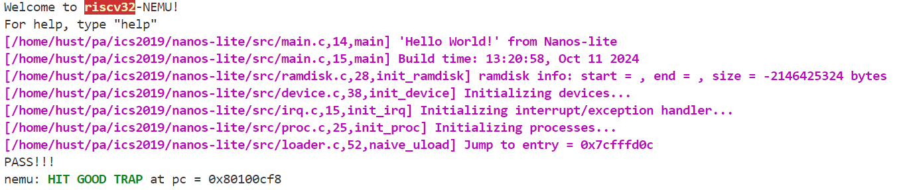

简易文件系统完成！

#### 3.3.2 一切皆文件：操作系统上的IOE

##### (1) 串口抽象为文件

RTFM，很容易知道这一步我们要做的是修改 `file_table`，并且完善`serial_write()`函数。具体来说是这样：

`fs.c`文件：

```C
// PA3.3 added
extern size_t serial_write(const void*, size_t, size_t);    // for stdout and stderr

/* This is the information about all files in disk. */
static Finfo file_table[] __attribute__((used)) = {
  {"stdin", 0, 0, 0, invalid_read, invalid_write},
  {"stdout", 0, 0, 0, invalid_read, serial_write},
  {"stderr", 0, 0, 0, invalid_read, serial_write},
#include "files.h"
};
```

`device.c`文件：

```C
size_t serial_write(const void *buf, size_t offset, size_t len) {
  for (size_t i = 0; i < len; i++) {
    _putc(((char *)buf)[i]);
  }
  return 0;
}
```

然后`fs_write()`函数就不需要单独判断fd为1或者2的情况了。

##### (2) 设备输入抽象成文件

> ##### 把设备输入抽象成文件
>
> 你需要在Nanos-lite中
>
> - 实现`events_read()`(在`nanos-lite/src/device.c`中定义), 把事件写入到`buf`中, 最长写入`len`字节, 然后返回写入的实际长度. 其中按键名已经在字符串数组`names`中定义好了. 你需要借助IOE的API来获得设备的输入.
> - 在VFS中添加对`/dev/events`的支持.
>
> 让Nanos-lite加载`/bin/events`, 如果实现正确, 你会看到程序输出时间事件的信息, 敲击按键时会输出按键事件的信息.

补充的内容如下，基本均可以参考手册中的内容完成编写：

```C
// fs.c
extern size_t events_read(void*, size_t, size_t);           // for events
static Finfo file_table[] __attribute__((used)) = {
  {"/dev/events", 0, 0, 0, events_read, invalid_write},
#include "files.h"
};
```

```C
// device.c
size_t events_read(void *buf, size_t offset, size_t len) {
  int kc = read_key();
  char tmp[3] = "ku";
  if ((kc & 0xfff) == _KEY_NONE) {
    int time = uptime();
    len = sprintf(buf, "t %d\n", time);
  }
  else {
    if (kc & 0x8000)
      tmp[1] = 'd';
    len = sprintf(buf, "%s %s\n", tmp, keyname[kc & 0xfff]);
  }
  return len;
}
```

最终结果：

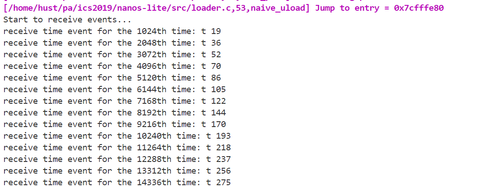

##### (3) VGA显存抽象成文件

> ##### VGA显存抽象成文件
>
> 你需要在Nanos-lite中:
>
> - 在`init_fs()`(在`nanos-lite/src/fs.c`中定义)中对文件记录表中`/dev/fb`的大小进行初始化.
> - 实现`fb_write()`(在`nanos-lite/src/device.c`中定义), 用于把`buf`中的`len`字节写到屏幕上`offset`处. 你需要先从`offset`计算出屏幕上的坐标, 然后调用IOE的`draw_rect()`.
> - 实现`fbsync_write()`(在`nanos-lite/src/device.c`中定义), 直接调用IOE的相应API即可.
> - 在`init_device()`(在`nanos-lite/src/device.c`中定义)中将`/proc/dispinfo`的内容提前写入到字符串`dispinfo`中.
> - 实现`dispinfo_read()`(在`nanos-lite/src/device.c`中定义), 用于把字符串`dispinfo`中`offset`开始的`len`字节写到`buf`中.
> - 在VFS中添加对`/dev/fb`, `/dev/fbsync`和`/proc/dispinfo`这三个特殊文件的支持.
>
> 让Nanos-lite加载`/bin/bmptest`, 如果实现正确, 你将会看到屏幕上显示Project-N的logo.

补充基本同上，代码如下：

```C
// device.c
size_t dispinfo_read(void *buf, size_t offset, size_t len) {
  len = sprintf(buf, dispinfo + offset);
  return len;
}

size_t fb_write(const void *buf, size_t offset, size_t len) {
  int x = (offset/4) % screen_width();
  int y = (offset/4) / screen_width();
  draw_rect((uint32_t*)buf, x, y, len/4, 1);
  return len;
}

size_t fbsync_write(const void *buf, size_t offset, size_t len) {
  draw_sync();
  return 0;
}

void init_device() {
  Log("Initializing devices...");
  _ioe_init();

  // TODO: print the string to array `dispinfo` with the format
  // described in the Navy-apps convention
  sprintf(dispinfo, "WIDTH:%d\nHEIGHT:%d\n", screen_width(), screen_height());
}

```

```C
// fs.c
extern size_t dispinfo_read(void*, size_t, size_t);         // for dispinfo
extern size_t fb_write(const void*, size_t, size_t);        // for fb
extern size_t fbsync_write(const void*, size_t, size_t);    // for fbsync

/* This is the information about all files in disk. */
static Finfo file_table[] __attribute__((used)) = {
  {"/dev/fb", 0, 0, 0, invalid_read, fb_write},
  {"/dev/fbsync", 0, 0, 0, invalid_read, fbsync_write},
  {"/proc/dispinfo", 0, 0, 0, dispinfo_read, invalid_write},
#include "files.h"
};
```

最终结果：

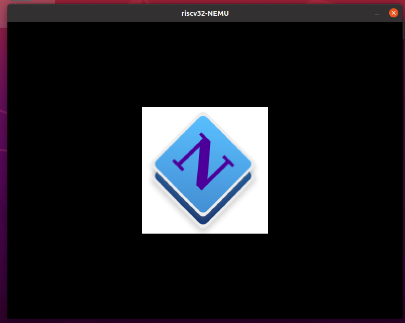

OK，3.3终于补完了！在这里发生了一些致命的问题：由于网络问题或是其他不知名原因，PA3的代码经历了一次完全重构，其中耗费的时间和精力难以估计。这警惕我们：一定要经常备份！！

### PA3.4 批处理系统

#### 3.4.1 运行仙剑奇侠传

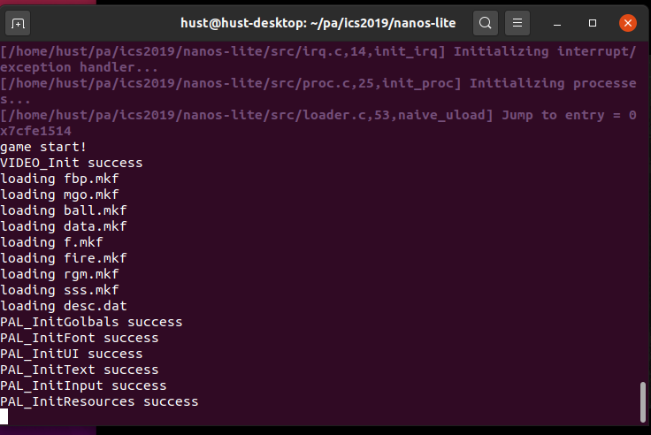


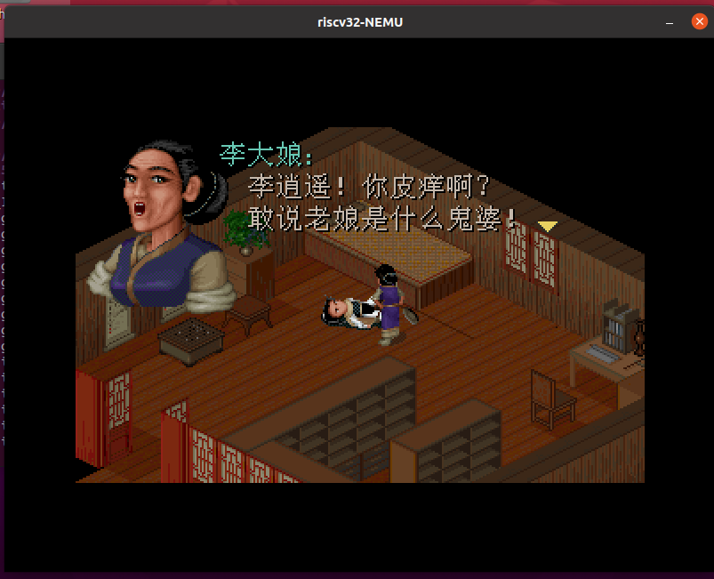

#### 3.4.2 批处理系统展示

> Navy-apps准备了一个开机菜单程序, 在Nanos-lite中加载`/bin/init`就可以运行它了. 不过为了运行它, 你还需要在VFS中添加一个特殊文件`/dev/tty`, 只要让它往串口写入即可. 这个开机菜单程序中准备了若干项选择, 你可以通过键入数字来选择运行相应的程序. 

这一步非常简单易懂，按照所说的操作即可。此时运行后会生成如下窗口：

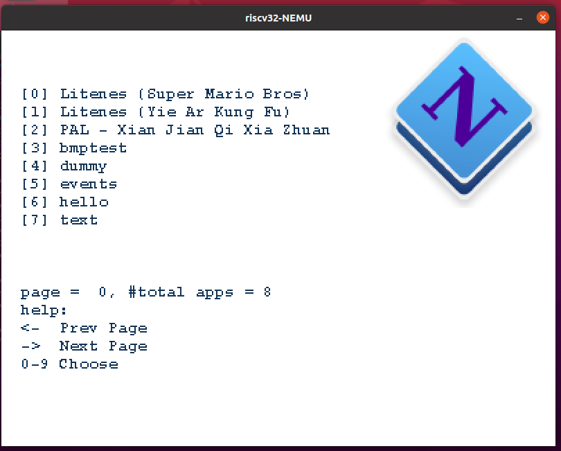

> 不过你会发现, 键入数字之后就会触发HIT BAD TRAP, 这是因为我们需要实现一个新的系统调用.
>
> 这个系统调用就是`SYS_execve`, 它的作用是结束当前程序的运行, 并启动一个指定的程序. 这个系统调用比较特殊, 如果它执行成功, 就不会返回到当前程序中, 具体信息可以参考`man execve`. 为了实现这个系统调用, 你只需要在相应的系统调用处理函数中调用`naive_uload()`就可以了. 目前我们只需要关心`filename`即可, `argv`和`envp`这两个参数可以暂时忽略.

需要做的事也比较明确，就是实现`SYS_execve`系统调用。

> 再给一些提示吧：
>
> + 你可以通过`cte.c`中的printf判断需要加哪一个case；
> + 这里加的是13，调用`SYS_execve`。
> + 你要加的代码绝大多数在`syscall.c`中，但千万不要忘记，还需要在用户层实现`SYS_execve`的调用，这里面暂时还是exit。
> + 不要忘记修改`loader`和`proc`中的相关内容，以保证打开的文件是你想要的内容。

展示`syscall.c`中相关代码如下：

```C
#include "common.h"
#include "syscall.h"
// PA3.4 updated
#include "fs.h"
#include "proc.h"
// PA3.4 updated
int sys_execve(const char *pathname, char *const argv[], char *const envp[]);
_Context* do_syscall(_Context *c) {
  switch (a[0]) {
    case SYS_exit:
      sys_exit(a[1]);
      break;
    case SYS_execve:
      printf("%s\n", a[1]);
      sys_execve((const char*)a[1], NULL, NULL);
      c->GPR2 = SYS_exit;
      do_syscall(c);
      break;
    default: panic("Unhandled syscall ID = %d", a[0]);
  }
  return NULL;
}

void sys_yield() {
  _yield();
}

void sys_exit(int code) {
  // _halt(code);
  return sys_execve("/bin/init", NULL, NULL);
}

int sys_execve(const char *pathname, char *const argv[], char *const envp[]) {
  naive_uload(NULL, pathname);
  return 0;
}
```

如下。搞定了！

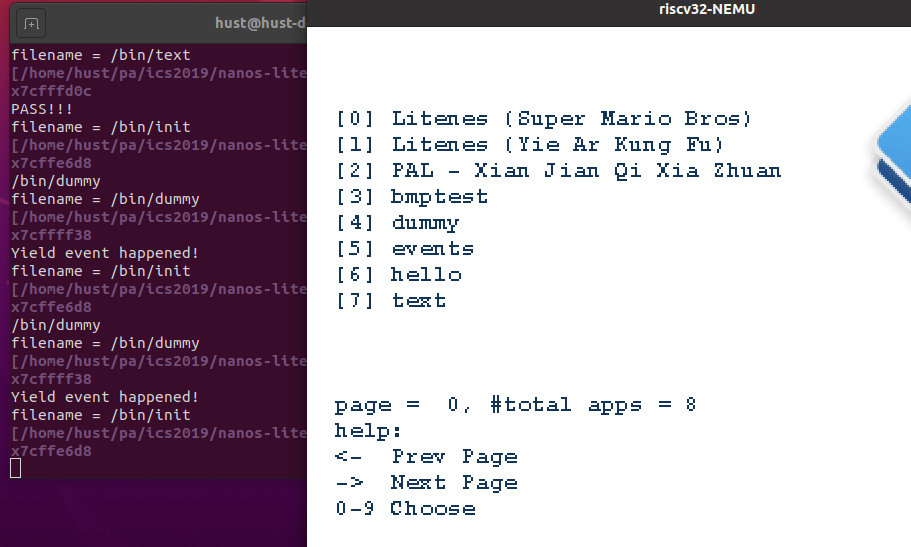

到这里，PA3在曲折中结束！

## PA4 虚实交错：分时多任务

### PA4.1 多道程序

