## PA0-准备工作

下载导入了老师统一的环境资源包，导入后即可使用。使用了ssh远程开发。vscode还是好用得多www。

### PA0.0 设置SSH免密登录

#### 0.0.1 获取虚拟机网卡IP地址

给虚拟机新增一块网卡，启用网络连接、连接方式选择仅主机。

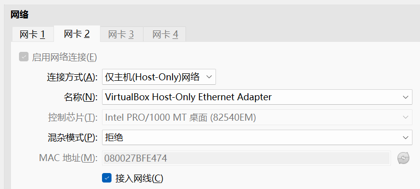

添加后重新启动虚拟机并打开终端，分别执行如下两条指令：

```shell
sudo apt-get install net-tools
ifconfig
# 事实上，如果你很熟悉ifconfig指令，你就知道这个指令用来获得网卡配置属性，
# 而这个指令需要安装上面的依赖。
# 不记得上面这条安装指令？事实上，如果你的虚拟机没安装该以来而你直接输入了ifconfig，会提示你需要安装它的。
```

然后可以看到如下信息：

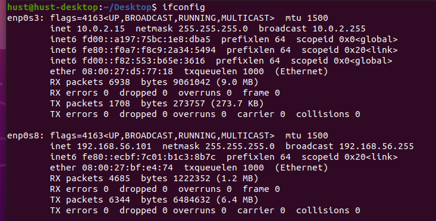

enp0s8就是新创建的网卡，其中包含了其分配到的IPv4地址：192.168.56.101，这就是ssh连接时所用的IP地址。

#### 0.0.2 配置SSH，完成连接

继续在虚拟机配置：

```shell
# 安装ssh服务依赖
sudo apt-get install openssh-server
# 启动ssh
sudo /etc/init.d/ssh start
sudo systemctl enable ssh
# 备份
sudo cp /etc/ssh/sshd_config /etc/ssh/sshd_config.backup
# 修改相应配置
sudo vim /etc/ssh/sshd_config
```

在打开的文件中追加以下内容：

```shell
Port 22
AddressFamily any
ListenAddress 0.0.0.0
ListenAddress ::
UsePrivilegeSeparation no
PasswordAuthentication yes
PermitRootLogin yes
AllowUsers hust				# 此处的用户名是你的用户名，本实验中即hust(老师的配置)
RSAAuthentication yes
PubKeyAuthentication yes
```

ssh配置完成。理论上，此时在vscode中加上相应配置（如下），就可以在远程进行编程开发了。

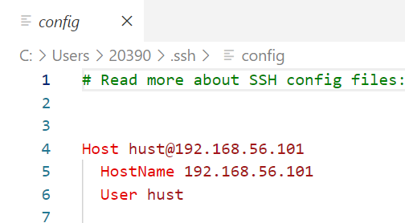

多一句嘴：vscode左下角可以远程连接ssh，配置也在这里可以直接进入修改！

#### 0.0.3 SSH免密登录

但是完成以上操作以后，每次登录，乃至切换工作文件夹都要输入密码。如何设置免密登录？

在虚拟机中输入指令，然后一路回车：

```shell
ssh-keygen
```

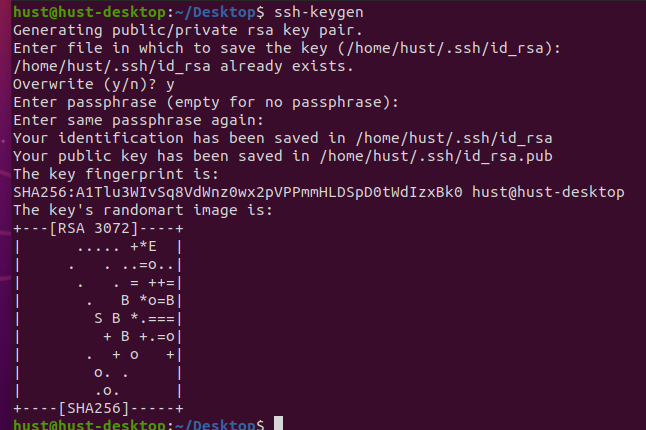

然后将 `~/.ssh/id_rsa.pub` 文件复制到 `~/.ssh/authorized_keys` 文件中。

本机上同样输入ssh-keygen，如果之前已经生成过公钥，中间注意看有一步要进行相应的选择（如果需要覆写，则输入y后继续回车，）：

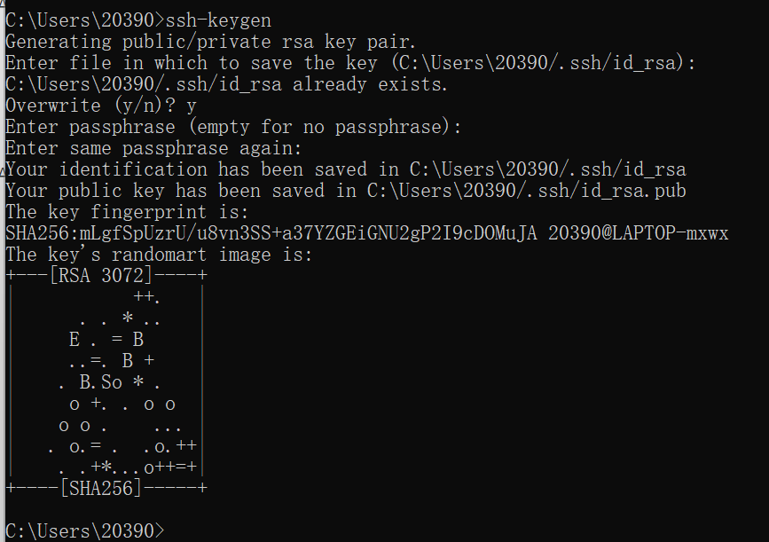

然后打开刚刚生成公钥时展示的保存公钥的路径，选择复制对应文件中的公钥。接下来回到虚拟机进行如下操作：

```shell
# 把刚才粘贴的公钥追加到本文的末尾，保存退出
vim ~/.ssh/authorized_keys
# 修改读写权限，重启ssh
sudo chmod 600 ~/.ssh/authorized_keys
sudo chmod 700 ~/.ssh
sudo service ssh restart
```

现在你可以用vscode愉快地进行SSH免密登录和远程开发了>v<

## PA1-开天辟地，起始章节

为了提高调试的效率, 同时也作为熟悉框架代码的练习, 我们需要在monitor中实现一个具有如下功能的简易调试器：

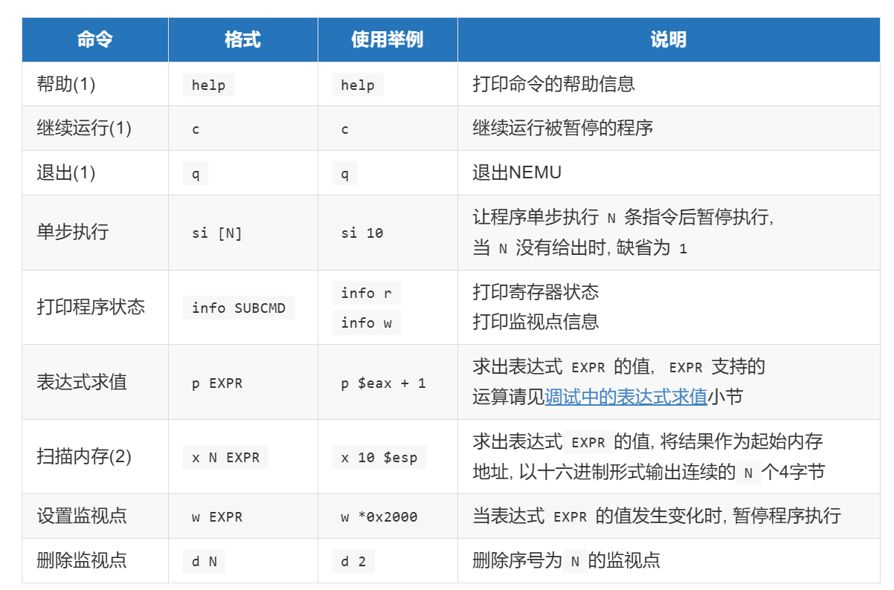

### PA1.1 单步执行

了解strtok()的相关内容：（该函数用于用制定分隔符来分割字符串）

> 	char *strtok(char *str, const char *delim);
> 	   														
> 	strtok() 函数将字符串分解为由零个或多个非空标记组成的序列。第一次调用 strtok() 时，应在 str 中指定要解析的字符串。在随后每次解析同一字符串的调用中，str 必须为空。delim 参数指定了一组字节，用于分隔解析字符串中的标记。 调用者可以在解析同一字符串的连续调用中，在 delim 中指定不同的字符串。
> 	    														
> 	返回值： strtok() 和 strtok_r() 函数返回指向下一个标记的指针，如果没有更多标记，则返回 NULL。

利用strtok()函数可以读出si接续的参数N（如果有的话，没有则默认N值为1），并调用cpu_exec()函数来完成对于N步的执行。代码如下。

```C
static int cmd_si(char *args){
  char *steps = strtok(args, " ");
  int n=1;
  if(steps != NULL){
    n = atoi(steps);      // ascii to integer
  }
  cpu_exec(n);
  return 0;
}
```

### PA1.2 打印寄存器

同样是利利用strtok()函数可以读出info接续的参数arg，如果arg对应为字符串"r"，则表示目前执行的是打印寄存器的任务。代码框架中在`nemu/src/isa/riscv32/reg.c`目录中定义了isa_reg_display()函数，可以在其中完成对寄存器值的输出（基本为补充printf）。isa_reg_display()函数的补充和cmd_info的代码分别如下（info中包含了监视点的前置代码）。

```C
void isa_reg_display() {
  // printf("%4s  0x%08x\n", "pc",cpu.pc);
  for (int i = 0; i < 32; i++) {
    printf("%4s  0x%08x  %8d\n", regsl[i], cpu.gpr[i]._32, cpu.gpr[i]._32);
  }
}
```

```C
static int cmd_info(char *args){
  char *arg = strtok(NULL, " ");
  if(arg == NULL){
    printf("Unknown command, please input the subcmd!\n");
  }
  else if(strcmp(arg, "r") == 0){
    isa_reg_display();
  }
  else if(strcmp(arg, "w") == 0){

  }
  else{
    printf("Unknown command, please check the subcmd!\n");
  }
  return 0;
}
```


### PA1.3 扫描内存

利用了strtol()函数。其形式如下：

```c
long int strtol(const char *str, char **endptr, int base)
```

参数的含义：

- **str** -- 要转换为长整数的字符串。
- **endptr** -- 对类型为 char* 的对象的引用，其值由函数设置为 **str** 中数值后的下一个字符。
- **base** -- 基数，必须介于 2 和 36（包含）之间，或者是特殊值 0。如果 base 为 0，则会根据字符串的前缀来判断进制：如果字符串以 '0x' 或 '0X' 开头，则将其视为十六进制；如果字符串以 '0' 开头，则将其视为八进制；否则将其视为十进制。

利用该函数就可以将输入的地址字符串转换为对应地址数字，从而可以读取对应地址上的数值并且输出，同时根据输入的参数控制该过程的循环次数，扫描内存也就完成了。对应函数关键代码如下。

```C
static int cmd_x(char *args) { 
	char *N = strtok(NULL, " ");
  char *arg = strtok(NULL, " ");
  if(N == NULL || arg == NULL){
    printf("Unknown command, please input the N and the address!\n");
    return 0;
  }
  int n = atoi(N);
	paddr_t addr = strtol(arg, NULL, 16);
	for(int i=0; i<n; i++) {
		printf("0x%08x: ", addr);
		for(int j=0; j<4; j++) {
			printf("%02x ", paddr_read(addr, 1));
			addr++;
		}
		printf("\n");
	}
	return 0;
}
```

### PA1.4 表达式求值

PA实验中使用以下方法解决表达式求值的问题:

1. 首先识别出表达式中的单元
2. 根据表达式的归纳定义进行递归求值

因此要拆成两个步骤分别分析。

#### 1.4.1 词法分析

第一步的重点在于识别出一个表达式的所有token。token所包含的内容文档中有列举（实际上还包含很多其他内容，包括十六进制整数、八进制整数，其他各类运算符，寄存器等等）。这个过程即词法分析的过程，属于编译原理的范畴。框架在nemu/src/monitor/debug/expr.c中已经给出，我们需要完善的内容如下：

```C
/* PA1.4 表达式求值_task1_1: 补充token类型*/
enum {
  TK_NOTYPE = 256,    // spaces
  TK_EQ,              // equal
  TK_NEQ,             // not equal
  TK_NUM,             // number
  TK_HEX_NUM,         // hex number
  TK_AND,             // and
  TK_OR,              // or
  TK_REG,             // register
};
```

```C
static struct rule {
  char *regex;
  int token_type;
} rules[] = {
  // PA1.4 表达式求值_task1_2: 补充规则,词法分析
  {" +", TK_NOTYPE},    // spaces
  {"\\*", '*'},         // multiply
  {"\\/", '/'},         // divide
  {"\\+", '+'},         // plus
  {"\\-", '-'},         // minus
  {"==", TK_EQ},        // equal
  {"!=", TK_NEQ},       // not equal
  {"0x[0-9a-fA-F]+", TK_HEX_NUM}, // hex number
  {"[0-9]+", TK_NUM},   // number
  {"\\(", '('},         // left bracket
  {"\\)", ')'},         // right bracket
  {"&&", TK_AND},       // and
  {"\\|\\|", TK_OR},    // or
  {"\\$[a-zA-Z]+", TK_REG}, // register
};
```

```C
/* PA1.4 表达式求值_task1_3: 补充token类型
 * tokens数组中的每一个元素都是一个token结构体，包含两个成员：
 * 1. type: 表示token的类型，是一个整数，可以是上面定义的TK_NOTYPE、TK_EQ等
 * 2. str: 表示token的字符串，是一个字符数组，用于存储token的字符串
*/
switch (rules[i].token_type) {
      // TK_NOTYPE:break;
  case TK_NOTYPE:break;
  case TK_NUM: 
  {
    if (substr_len>32) { puts("The length of number is too long!"); return false; }
          tokens[nr_token].type='0';
    strncpy(tokens[nr_token].str,substr_start,substr_len);
    tokens[nr_token].str[substr_len]='\0';
    ++nr_token;
    break;
  }
  case TK_HEX_NUM:
  {
    if (substr_len>32) { puts("The length of number is too long!"); return false; }
    tokens[nr_token].type='6';
    strncpy(tokens[nr_token].str,substr_start+2,substr_len-2);
    tokens[nr_token].str[substr_len-2]='\0';
    ++nr_token;
    break;
  }

  // brackets
  case '(':
  case ')':

  // operators
  case '*':
  case '/':
  case '-':
  case '+':
  case TK_EQ:
  case TK_NEQ:
  case TK_AND:
  case TK_OR:{tokens[nr_token++].type=rules[i].token_type;break;}

  case TK_REG:
  {
    tokens[nr_token].type='r';  
    strncpy(tokens[nr_token].str,substr_start+1,substr_len-1);
    tokens[nr_token].str[substr_len-1]='\0';
    ++nr_token;
    break;
  }
  default: TODO();
}
```

以上的部分，成功将输入的长表达式拆分成若干个token。接下来就是根据这些拆分完毕的token进行相应的数据运算了。

#### 1.4.2 递归求值（包含扩展）

根据BNF定义, 一种解决方案已经逐渐成型了: 既然长表达式是由短表达式构成的, 我们就先对短表达式求值, 然后再对长表达式求值。 这种十分自然的解决方案就是分治法（一种非常经典的算法）。关于表达式求值的代码框架已经给出，我们需要将其具体实现。详细一点来说，需要进行两个步骤：

1. 是检查括号匹配性，保证表达式的合法性，不合法则不需要再继续进行；
2. 对当前唯一的运算式进行表达式求值。需要注意：

> 表达式有二元也有一元的，需要针对具体形式进行具体的分析。在此之前需要进行一次token的处理，即将单目运算符的'\*'（指针解引用）与双目运算符的'\*'（乘法运算符）区分开来。只需计算一次，因此可以在expr函数中，完成了make_token之后做这件事。

代码如下：

```C
/* PA1.4 表达式求值_task2_1: 检查括号匹配
 * 检查表达式中的括号是否匹配
*/
uint32_t check_parentheses(int start, int end){
  if (tokens[start].type != '(' || tokens[end].type != ')') {
    return false;
  }
  int i, cnt = 0;
  for (i = start + 1; i < end; i++) {
    if (tokens[i].type == '(') {
      cnt++;
    }
    else if (tokens[i].type == ')') {
      cnt--;
    }
    if (cnt < 0) {
      return false;
    }
  }
  return true;
}
```

```C
// PA1.4 表达式求值_task2_2_1: 定义运算符优先级
uint32_t operator_priority(int type) {
  switch (type) {
    case TK_OR: return 1;
    case TK_AND: return 2;
    case TK_EQ: case TK_NEQ: return 3;
    case '+': case '-': return 4;
    case '*': case '/': return 5;
    case TK_DEREF: return 6;
    default: return 0;
  }
}
```

```C
// PA1.4 表达式求值_task2_2_2: 寻找主运算符
uint32_t main_operator(int start, int end) {
  int i, cnt = 0, main_op = -1;
  uint32_t main_pri = 10;
  for (i = start; i <= end; i++) {
    if (tokens[i].type == '(') {
      cnt++;
    }
    else if (tokens[i].type == ')') {
      cnt--;
    }
    if (cnt == 0) {
      if (tokens[i].type == '+' || tokens[i].type == '-' || tokens[i].type == '*' || tokens[i].type == '/' 
                || tokens[i].type == TK_EQ || tokens[i].type == TK_NEQ || tokens[i].type == TK_AND || tokens[i].type == TK_OR
                || tokens[i].type == TK_DEREF) 
      {
        if (operator_priority(tokens[i].type) < main_pri) {
          main_pri = operator_priority(tokens[i].type);
          main_op = i;
        }
      }
    }
  }
  return main_op;
}
```

```C
// PA1.4 表达式求值_task2_3: 表达式求值
uint32_t eval(int start, int end, bool *success) {
  if (start > end) {
    /* Bad expression */
    *success = false;
    return 0;
  }
  else if (start == end) {
    // Single token.
    // printf("now token type is %c\n", tokens[start].type);
    // printf("now token is %s\n", tokens[start].str);
    int result = 0;
    if(tokens[start].type == '0'){
      result = atoi(tokens[start].str);
    }
    else if(tokens[start].type == '6'){
      result = strtol(tokens[start].str, NULL, 16);
    }
    else if(tokens[start].type == 'r'){
      result = isa_reg_str2val(tokens[start].str, success);
      // printf("now the address is 0x%x\n", result);
    }
    else assert(0);
    if (*success == false) {
      return 0;
    }
    // printf("now result is %d\n", result);
    return result;
  }
  else if (check_parentheses(start, end) == true) {
    // The expression is surrounded by a matched pair of parentheses.
    return eval(start + 1, end - 1, success);
  }
  else {
    // Find the dominant operator in the token expression.
    int op = main_operator(start, end);
    if (op == -1) {
      // printf("no main operator found\n");
      *success = false;
      return 0;
    }
    // PA1.4 表达式求值_task2_4: 补充对指针解引用的处理
    else if(tokens[op].type == TK_DEREF){
      uint32_t val = eval(op + 1, end, success);
      if (*success == false) {
        return 0;
      }
      return vaddr_read(val, 4);
    }
    uint32_t val1 = eval(start, op - 1, success);
    uint32_t val2 = eval(op + 1, end, success);
    if (*success == false) {
      return 0;
    }
    // printf("now operator is %c\n", tokens[op].type);
    switch (tokens[op].type) {
      case '+': return val1 + val2;
      case '-': return val1 - val2;
      case '*': return val1 * val2;
      case '/': return val1 / val2;
      case TK_EQ: return val1 == val2;
      case TK_NEQ: return val1 != val2;
      case TK_AND: return val1 && val2;
      case TK_OR: return val1 || val2;
      default: assert(0);
    }
    
  }
}
```

```C
uint32_t expr(char *e, bool *success) {
  if (!make_token(e)) {
    *success = false;
    return 0;
  }
  // PA1.4 表达式求值_task2_4: 补充对指针解引用的处理
  for(int i=0;i<nr_token;++i){
    if(tokens[i].type=='*'&&(i==0||(tokens[i-1].type!=')'&&tokens[i-1].type!='0'&&tokens[i-1].type!='6'&&tokens[i-1].type!='r'))){
      tokens[i].type=TK_DEREF;
    }
  }
  *success = true;
  return eval(0, nr_token - 1, success);

  return 0;
}
```

OK了！

#### 1.4.3 补充ui.c中函数框架

不必多言，和前面一样。

```C
static int cmd_p(char *args) {
  char *arg = strtok(NULL, " ");
  bool success = true;
  uint32_t result = expr(arg, &success);
  if(success) {
    printf("%s = %u\n", arg, result);
  }
  else {
    printf("Invalid expression!\n");
  }
  return 0;
}
```

至此，表达式求值（包含扩展）完成！

~~至于要不要补充测试代码……看后面进度orz~~

### PA1.5 监视点

文档中关于扩展表达式求值的内容已经在前一部分的内容中完成了补充和说明。详见前文。

在`nemu/include/monitor/watchpoint.h`中定义了监视点的数据结构，我们需要补充数据成员以方便后续的操作。这里添加了三个数据成员，具体如下：

```C
typedef struct watchpoint {
  int NO;
  struct watchpoint *next;

  /* TODO: Add more members if necessary */
  char expr[65536];             // watchpoint expression
  bool valueChanged;            // if the value of the watchpoint has changed
  uint32_t oldValue,nowValue;   // the value of the watchpoint

} WP;
```

由此来构成一个监视点的结点数据结构。易知，监视点列表是由单向链表构成的。以此作为线索，需要定义两个函数new_wp()和free_wp()，分别用于创建一个监视点以及释放一个监视点。这一部分就是单链表的操作，比较简单，需要注意的是定义了两个链表`*head, *free_`分别用于存储正在使用的监视点和空闲监视点，在创建和删除的时候需要分别进行相应的修改。代码如下。

```C
WP* new_wp(char* expre) {
  if (free_ == NULL) { assert(0); return NULL; }
  WP* res = free_;
  free_ = free_->next;
  res->next = head;
  head = res;
  if(strlen(expre) >= strlen(res->expr)) {assert("expression too long");}
  strcpy(res->expr, expre);

  bool success = true;
  res->nowValue = res->oldValue = expr(res->expr, &success);
  if(!success) {assert("Wrong expression");}

  return res;
}
```

```C
bool free_wp(int No){
  WP* p = head;
  WP* pre = NULL;
  while(p != NULL) {
    if(p->NO == No) {
      if(pre == NULL) {
        head = p->next;
      }
      else {
        pre->next = p->next;
      }
      p->next = free_;
      free_ = p;
      return true;
    }
    pre = p;
    p = p->next;
  }
  return false;
}
```

接下来需要做的事是实现监视点的相关功能。监视点的功能应该包括显示其表达式的值，以及监视点表达式的值发生变化时让程序因触发了监视点而暂停下来。因此需要再添加两个函数：`watchpoint_display()`用于打印监视点的信息（这个函数用于操作info w时的调用，这是容易得知的），`check_wp()`则用来检查监视点的表达式值是否发生改变（如果发生了改变输出相应的提示信息）。

```C
void watchpoint_display() {
  WP* p = head;
  while(p != NULL) {
    printf("watchpoint %d: %s\n", p->NO, p->expr);
    printf("old value: %u\n", p->oldValue);
    printf("new value: %u\n", p->nowValue);
    p = p->next;
  }
}
```

```C
bool check_wp() {
  WP* p = head;
  bool flag = false;
  while(p != NULL) {
    bool success = true;
    p->nowValue = expr(p->expr, &success);
    if(!success) {assert("Wrong expression");}
    if(p->nowValue != p->oldValue) {
      flag = true;
      printf("Hit watchpoint!\n");
      printf("watchpoint %d: %s\n", p->NO, p->expr);
      printf("old value: %u\n", p->oldValue);
      printf("new value: %u\n", p->nowValue);
      p->oldValue = p->nowValue;
    }
    p = p->next;
  }
  return flag;
}

```

`check_up()`函数的调用位置也值得思考。每当`cpu_exec()`执行完一条指令, 就对所有待监视的表达式进行求值。需要将`nemu_state.state`变量设置为`NEMU_STOP`来达到暂停的效果。由此其添加的位置也比较好确定了，即在`nemu/src/monitor/cpu-exec.c`中：

```C
    /* TODO: check watchpoints here. */
  if(check_wp()) {
    nemu_state.state = NEMU_STOP;
  }
```

使用`d`命令来删除监视点, 你只需要释放相应的监视点结构即可，因此可以直接调用free_wp。

最后，将`nemu/src/monitor/debug/ui.c`中的相应函数补充完毕：

```C
static int cmd_w(char *args) {
  char *arg = strtok(NULL, " ");
  if(arg == NULL){
    printf("Unknown command, please input the expression!\n");
    return 0;
  }
  WP* wp = new_wp(arg);
  printf("Set watchpoint %d for %s\n", wp->NO, wp->expr);
  return 0;
}
```

```C
static int cmd_d(char *args) {
  char *arg = strtok(NULL, " ");
  if(arg == NULL){
    printf("Unknown command, please input the watchpoint number!\n");
    return 0;
  }
  int n = atoi(arg);
  if(free_wp(n)){
    printf("Delete watchpoint %d\n", n);
  }
  else{
    printf("No watchpoint %d\n", n);
  }
  return 0;
}
```

### PA1-- 结语--

首先补充一下help（帮助文档）的内容：

```C
static struct {
  char *name;
  char *description;
  int (*handler) (char *);
} cmd_table [] = {
  { "help", "Display informations about all supported commands", cmd_help },
  { "c", "Continue the execution of the program", cmd_c },
  { "q", "Exit NEMU", cmd_q },
  { "si", "Execute N instructions in a single step", cmd_si},
  { "info", "Print the state of the program",cmd_info},
  { "x", "Scan memory", cmd_x},
  { "p", "Evaluate the expression", cmd_p},
  { "w", "Set watchpoint", cmd_w},
  { "d", "Delete watchpoint", cmd_d},


  /* TODO: Add more commands */

};
```

## PA2-简单复杂机器，冯诺依曼机系统

### PA2.0 补充

#### 2.0.1 riscv32I指令格式

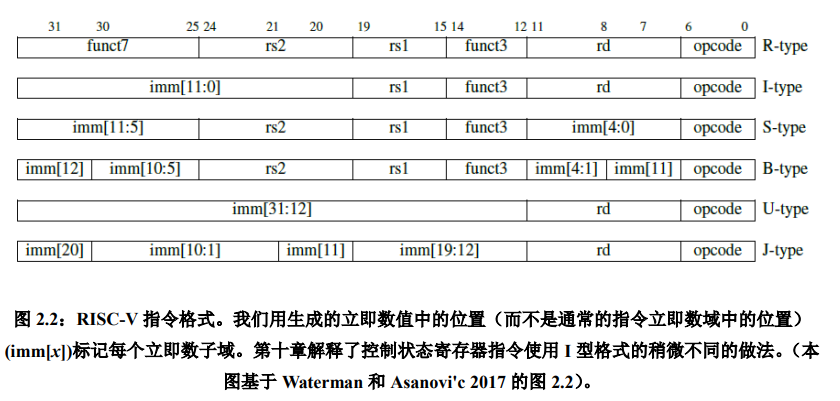

#### 2.0.2 设置交叉编译器

下载好交叉编译器到本地（注意版本），传到虚拟机里，注意路径。

> 如果你搞不懂这一步，请去学习scp怎么使用。

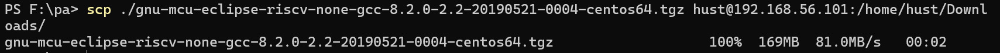

传完解压，然后修改环境变量（注意路径），之后执行`riscv-none-embed-gcc`，出现下面的结果就没有问题。

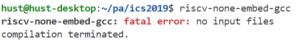

### PA2.1 RTFSC，运行第一个C程序

C程序反汇编结果：

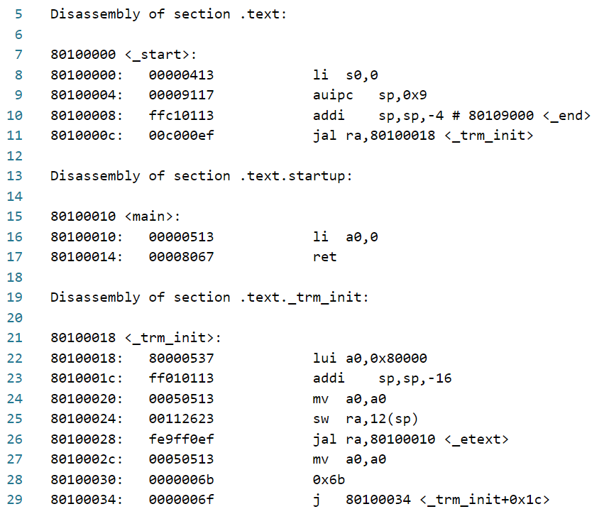

由此，知需要实现的指令为`lui, auipc, addi, jal, ret, mv, sw, j, li`这些。

> **为了实现一条新指令, 你需要**
>
> 1. 在`opcode_table`中填写正确的译码辅助函数, 执行辅助函数以及操作数宽度
> 2. 用RTL实现正确的执行辅助函数, 需要注意使用RTL伪指令时要遵守上文提到的小型调用约定

#### 2.1.1 opcode_table补充

我们首先来搞清楚opcode_table的妙用。进行一番一顿操作猛如虎的RTFSC，找到了`opcode_table`的位置在`nemu/src/isa/riscv32/exec/exec.c`里，长这样：

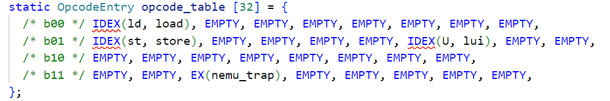

可以看到里面已经有了一个包含着lui指令的`OpcodeEntry`。那么现在我们需要探索`opcode_table`是怎么用的，从而来摸索我们到底要怎么利用它来完成指令执行。

> 取出`opcode`之后, 框架代码用它来对`opcode_table`数组进行索引, 取出其中的一个`OpcodeEntry`类型的元素. `opcode_table`数组其实就是我们之前提到的译码查找表, 这一张表通过操作码opcode来索引, 它记录了每一个opcode对应指令的译码辅助函数, 执行辅助函数, 以及操作数宽度. 有了这些信息, 我们就可以得知指令的具体操作了, 例如对两个寄存器进行加法操作.
>
> 这个从译码查找表中取得的元素将会被作为参数, 调用`idex()`函数(在`nemu/include/cpu/exec.h`中定义). 顾名思义, 这个函数就是用来进行译码和执行的.
>

所以！我们可以知道`opcode_table`是用来索引操作码的，也即确定我们要使用的是具体哪一条指令。那么，接下来需要搞清楚的就是怎么利用它来完成指令的译码了。继续RTFM和RTFSC，接下来关注`idex()`函数。可以看到调用它时会关注到指令的特定位。然后关注`isa_exec()`函数，发现这里的`idex()`函数用到了`opcode_table`的内容！我们观察到其中关注的指令特定位是6~2。

##### (1) lui指令

U型指令，作用如下。

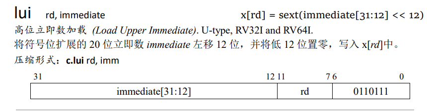

回到lui指令的指令格式，我们会发现对于属于U型指令的lui来说，6~2位对应的二进制数值是01101，即十进制的13，恰好对应着`opcode_table`中的第13个数据成员（从0开始编号），而它其中填充的内容正是`IDEX(U,lui)`！

> 注：这里二进制数值为01101，观察到`opcode_table`有32个数据成员，每一行8个，因此其每一行开头的注释内容是操作数的前两个数字，低三位可以直接定位到其在`opcode_table`中的准确位置。这很方便查找填充，很有思路，点赞。

茅塞顿开啊。依葫芦画瓢，其余的指令就有迹可循了。

##### (2) auipc指令

U型指令，说明如下。

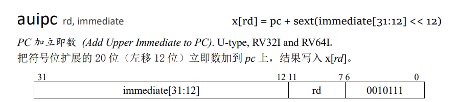

很轻松地知道了它的opcode应该是二进制的00101，也就是第一行的第5号数据成员。OK，填上。

##### (3) addi指令

I型指令，说明如下。

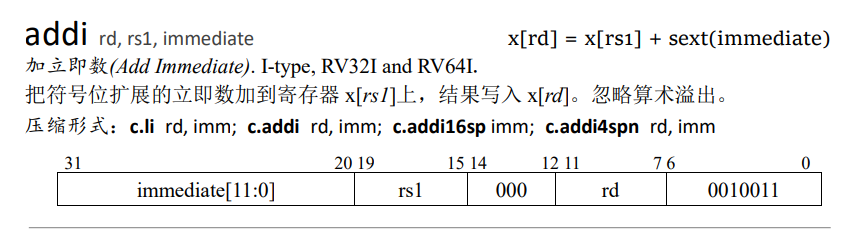

很同样很轻松地知道了它的opcode应该是二进制的00100，也就是第一行的第4号数据成员。OK，填上。

##### (4) jal指令

J型指令，说明如下。

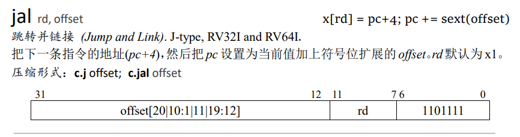

依旧很轻松地知道了它的opcode应该是二进制的11011，也就是第四行的第3号数据成员。OK，填上。

##### (5) ret指令

伪指令，实际被扩展为jalr。

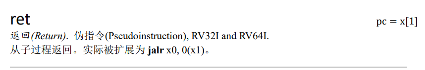

去看`jalr指令`：I型指令，说明如下。

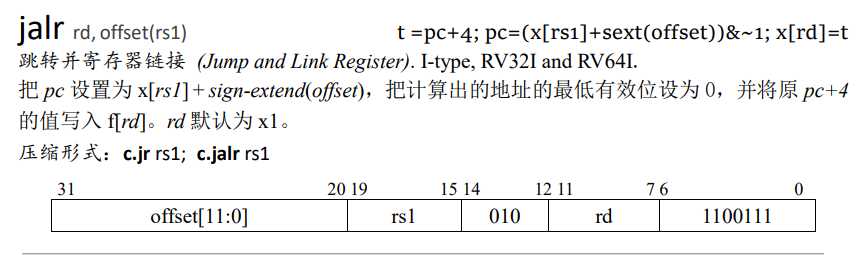

和之前都一样，它的opcode应该是二进制的11001，也就是第四行的第1号数据成员。OK，填上。

##### (6) mv指令

伪指令。实际用的是addi，不用多说。

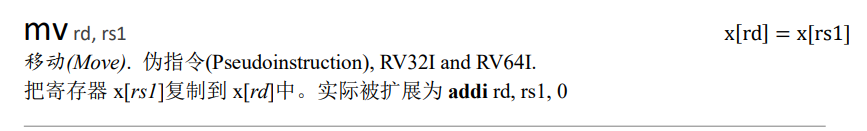

##### (7) sw指令

S型指令。说明如下。

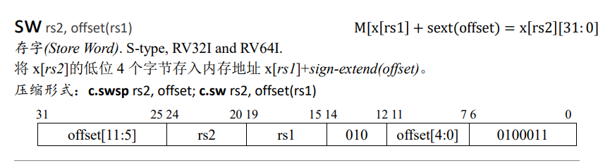

然后会发现table里已经填好了。

##### (8) J指令

伪指令，实际用的是jal。

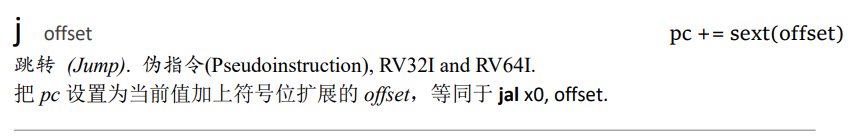

##### (9) li指令

伪指令，等同于执行lui和/或addi。

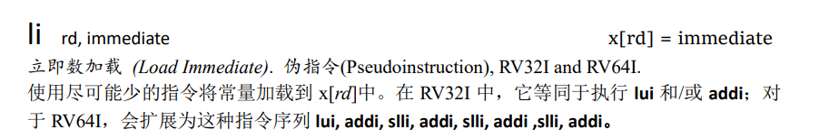

##### (10) 补完后

```C
static OpcodeEntry opcode_table [32] = {
  /* b00 */ IDEX(ld, load), EMPTY, EMPTY, EMPTY, IDEX(I, addi), IDEX(U, auipc), EMPTY, EMPTY,
  /* b01 */ IDEX(st, store), EMPTY, EMPTY, EMPTY, EMPTY, IDEX(U, lui), EMPTY, EMPTY,
  /* b10 */ EMPTY, EMPTY, EMPTY, EMPTY, EMPTY, EMPTY, EMPTY, EMPTY,
  /* b11 */ EMPTY, IDEX(I, jalr), EX(nemu_trap), IDEX(J, jal), EMPTY, EMPTY, EMPTY, EMPTY,
};
```


#### 2.1.2 辅助函数补充

前文分析之后，会发现我们真正需要完成补充的实际上只有为`lui, auipc, addi, jal, jalr`这几个，剩下的都是伪指令，事实上执行的事已经列出的这几种。接下来又要进行痛苦的STFSC和STFM了，因为我们完成了指令类型的判断，要开始进行后面辅助函数的补充了，而这需要我们知道要在哪写。

顺着藤摸了半天瓜，终于在`nemu/src/isa/riscv32/decode.c`和`nemu/src/isa/riscv32/exec/compute.c`摸到了想吃的瓜。前者是译码辅助函数，后者是执行辅助函数。瓜是找到了，吃起来可真不容易！

##### (1) lui指令

我们还是从lui指令开始分析，因为它是给出的参考框架。

`idex()`中的参数`e`为`IDEX(U,lui)`，我们接下来去`idex()`函数中分析，会发现需要用到`DHelper`和`EHelper`两个参数成员和相关调用。前者用于完成后续的译码工作，后者则用于辅助执行工作。

我们来到`nemu/src/isa/riscv32/decode.c`中，可以看到U型指令的操作数译码已经完成了。观察这个函数：

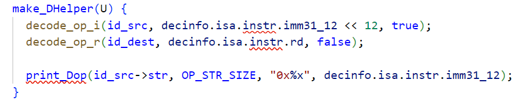

基本还是可以比较清楚地知道它的作用，实际上就是对U型指令的两个操作数（立即数和寄存器）进行译码处理，辅助译码过程的完成。

接下来到`nemu/src/isa/riscv32/exec/compute.c`里，观察：

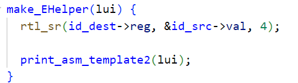

这个函数显然是辅助执行的。经过RTFM，我们知道实际上它就是完成lui的执行操作的。以上就是lui的整个执行过程。其余的指令也这样分析即可。

##### (2) auipc指令

U型指令，译码辅助函数已经给出来了，前面lui已经利用了。所以我们要做的就是完成auipc指令的实现。仿照lui指令相关的函数实现，根据auipc指令的规则来编写代码：

```C
make_EHelper(auipc) {
  rtl_add(&id_dest->val, &cpu.pc, &id_src->val);
  rtl_sr(id_dest->reg, &id_dest->val, 4);
  print_asm_template2(auipc);
}
```

auipc指令，很快搞定了。

##### (3) addi指令

I型指令。诶，出现了一个新的指令类型。其实如果对riscv熟悉的朋友应该已经开始有了一些警惕意识：I型指令（同样也包括S型指令，R型指令等等）数量很多，且是具有一些相似性的。如果一个一个写会不会产生什么严重后果，比如代码写出个几百上千行差不多的东西……OK，这个问题先放着，后面会处理的。我们先把运行第一个I型指令，最基础的addi指令给搞定。

不幸的是，I型指令的译码辅助函数没给，我们仿照`decode.c`里的函数来补充（如果对此没头绪，要结合PA2.0里的指令格式仔细分析）。

> 重要提醒！！！这里的函数，需要在`nemu/src/isa/riscv32/include/isa/decode.h`进行定义，不然用不了，识别不出来！一个非常简单的定义卡了我一万年……OTZ

```C
// pa2 added for I-type instructions
make_DHelper(I) {
  decode_op_r(id_src, decinfo.isa.instr.rs1, true);
  decode_op_i(id_src2, decinfo.isa.instr.simm11_0, true);
  print_Dop(id_src->str, OP_STR_SIZE, "%d(%s)", id_src2->val, reg_name(id_src->reg, 4));
  decode_op_r(id_dest, decinfo.isa.instr.rd, false);
}
```

接下来我们来搞定执行辅助函数：

```C
// PA2.1_3 addi
// 备注：这里是为了PA2.1的结果迅速得出，后面重构I型指令时非常有可能会删除这个函数
make_EHelper(addi) {
  rtl_add(&id_dest->val, &id_src->val, &id_src2->val);
  rtl_sr(id_dest->reg, &id_dest->val, 4);
  print_asm_template3(addi);
}
```

##### (4) jal指令

J型指令。又是一种新的指令类型。补充译码辅助函数：

```C
// pa2 added for J-type instructions
make_DHelper(J){
  int32_t offset = decinfo.isa.instr.simm20<<20 | decinfo.isa.instr.imm10_1<<1 | decinfo.isa.instr.imm11_<<11 | decinfo.isa.instr.imm19_12<<12;
  decode_op_i(id_src, offset, true);
  print_Dop(id_src->str, OP_STR_SIZE, "0x%x", offset);
  decode_op_r(id_dest, decinfo.isa.instr.rd, false);
}
```

补充执行辅助函数：

```C
// PA2.1_3: jal指令
make_EHelper(jal) {
  rtl_sr(id_dest->reg, &decinfo.seq_pc, 4);
  rtl_j(decinfo.seq_pc + id_src->val);

  print_asm_template2(jal);
}
```

##### (5) jalr指令

I型指令。

> 熟悉riscv指令集的小伙伴知道，jalr虽然归类于I型指令，但其实由于它改变了PC的值，所以我们一般将它归类在执行控制的指令中。

补充执行辅助函数：

> 关于辅助函数的补充说明：你可能不太清楚`difftest_skip_dut`的作用，可以在此处做一个标记，PA2.3会回来解答你的疑惑。

```C
// pa2.1_5 jalr
make_EHelper(jalr){
  uint32_t addr = cpu.pc + 4;
  rtl_sr(id_dest->reg, &addr, 4);

  decinfo.jmp_pc = (id_src->val+id_src2->val)&(~1);
  rtl_j(decinfo.jmp_pc);

  difftest_skip_dut(1, 2); //difftest_skip_dut(1, 2)表示跳过1个周期，2表示跳过的指令数

  print_asm_template2(jalr);
}
```

#### 2.1.3 测试执行

如下。

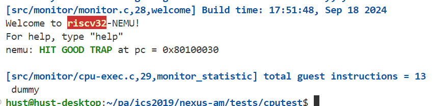

完成了！

### PA2.2 完善AM，实现更多程序

还记得前面遗留的问题吗？（忘了就去看前面）我们现在终于要对I, B, R等各个类型的指令进行统一化的管理了。因为很多相同类型的指令会面临opcode部分完全一致的问题，我们需要通过其他部分的内容进行区分，从而实现各个指令的正确读取，同时不至于~~使代码又臭又长~~。这里留一张图，是我们需要具体实现的riscv32指令，留存方便查阅。

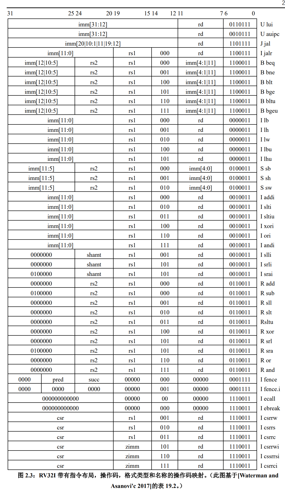

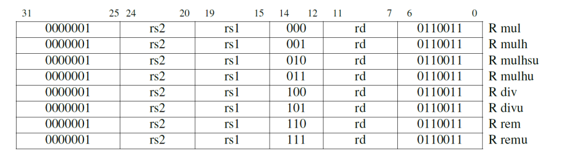

#### 2.2.1 补充ID/EX辅助函数

首先补充B, R, I型指令中对应的译码辅助函数。

##### (1) B型指令

观察B型指令操作码，发现opcode全都是相同的，因此都处于同一个`opcode_table`中，具体位置为序号18。在此不再单独列出，最后进行汇总的补充。

译码辅助函数补充如下：

```C
// pa2 added for B-type instructions
make_DHelper(B)
{
  decode_op_r(id_src, decinfo.isa.instr.rs1, true);
  decode_op_r(id_src2, decinfo.isa.instr.rs2, true);
  print_Dop(id_src->str, OP_STR_SIZE, "%s", reg_name(id_src->reg, 4));
  print_Dop(id_src2->str, OP_STR_SIZE, "%s", reg_name(id_src2->reg, 4));

  int32_t offset = decinfo.isa.instr.simm12<<12 | decinfo.isa.instr.imm10_5<<5 | decinfo.isa.instr.imm4_1<<1 | decinfo.isa.instr.imm11<<11;
  decode_op_i(id_dest, offset, true);

}
```

接下来是重要的执行辅助函数。观察所有B型指令，可以发现区分它们的是14~12位的funct3操作数。这样就可以将每条指令的执行操作分开了，之后再根据各条指令的不同意义编写代码即可。仔细观察B型指令，可以发现都是通过一次比较，从而决定是否对对应的offset值完成跳转。对应修改，完成此部分。

```C
// PA2.2 B-type instructions
make_EHelper(B_ir_18){
  decinfo.jmp_pc = cpu.pc + id_dest->val;
  switch(decinfo.isa.instr.funct3){
    case 0b000:     // beq||beqz
      rtl_jrelop(RELOP_EQ, id_src->val, id_src2->val, decinfo.jmp_pc);
      print_asm_template3(beq);
      break;
    case 0b001:     // bne||bnez
      rtl_jrelop(RELOP_NE, id_src->val, id_src2->val, decinfo.jmp_pc);
      print_asm_template3(bne);
      break;
    case 0b100:     // blt||bltz
      rtl_jrelop(RELOP_LT, id_src->val, id_src2->val, decinfo.jmp_pc);
      print_asm_template3(blt);
      break;
    case 0b101:     // bge||bgez
      rtl_jrelop(RELOP_GE, id_src->val, id_src2->val, decinfo.jmp_pc);
      print_asm_template3(bge);
      break;
    case 0b110:     // bltu
      rtl_jrelop(RELOP_LTU, id_src->val, id_src2->val, decinfo.jmp_pc);
      print_asm_template3(bltu);
      break;
    case 0b111:   // bgeu
      rtl_jrelop(RELOP_GEU, id_src->val, id_src2->val, decinfo.jmp_pc);
      print_asm_template3(bgeu);
      break;
    default:
      assert(0);
      break;
  }
}
```

##### (2) I型指令

I型指令在opcode中体现为三种，但是通过观察指令格式可以发现，实际上只有opcode不一样。第一种opcode为`0000011`，其实是半字、字节等的存取指令，归进了ld/st指令中；第二种opcode为`0010011`，也就是addi所在的位置，这将是我们编写I型指令代码的重点关注部分；最后一种opcode为`1110011`，程序中应该是没有这一部分的相应指令的。综上，译码辅助函数不需要再额外进行一次编写。我们检查一下所有需要实现的I型指令（其中jalr作为一个特例，不计入更大范围内的I型指令）：

| 指令  | funct3 | funct7         |
| ----- | ------ | -------------- |
| addi  | 000    | 包含于立即数中 |
| slti  | 010    | 包含于立即数中 |
| sltiu | 011    | 包含于立即数中 |
| xori  | 100    | 包含于立即数中 |
| ori   | 110    | 包含于立即数中 |
| andi  | 111    | 包含于立即数中 |
| slli  | 001    | 包含于立即数中 |
| srli  | 101    | 0000000        |
| srai  | 101    | 0100000        |

这下很明确了。针对它们完成函数的改编即可。（要记得前文`opcode_table`的addi需要改成I型指令，不然识别不出其余的了）

```C
// PA2.2 I-type instructions
make_EHelper(I_ir_4) {
  switch (decinfo.isa.instr.funct3) {
    case 0b000: // addi
      rtl_add(&id_dest->val, &id_src->val, &id_src2->val);
      break;
    case 0b010: // slti
      id_dest->val = (int32_t)id_src->val < (int32_t)id_src2->val;
      break;
    case 0b011: // sltiu
      id_dest->val = (unsigned)id_src->val < (unsigned)id_src2->val;
      break;
    case 0b100: // xori
      rtl_xor(&id_dest->val, &id_src->val, &id_src2->val);
      break;
    case 0b110: // ori
      rtl_or(&id_dest->val, &id_src->val, &id_src2->val);
      break;
    case 0b111: // andi
      rtl_and(&id_dest->val, &id_src->val, &id_src2->val);
      break;
    case 0b001: // slli
      rtl_shl(&id_dest->val, &id_src->val, &id_src2->val);
      break;
    case 0b101:
      if((decinfo.isa.instr.funct7) == 0b0000000) // srli
        rtl_shr(&id_dest->val, &id_src->val, &id_src2->val);
      else // srai
        rtl_sar(&id_dest->val, &id_src->val, &id_src2->val);
      break;
    default:
      assert(0);
  }
  rtl_sr(id_dest->reg, &id_dest->val, 4);
  print_asm_template3(I_ir_4);
}
```

##### (3) R型指令

R型指令的opcode都是`0110011`，对应进`opcode_table`就是二进制的01100，很容易定位。至此完成了`opcode_table`的补充：

```C
static OpcodeEntry opcode_table [32] = {
  /* b00 */ IDEX(ld, load), EMPTY, EMPTY, EMPTY, IDEX(I, Imm), IDEX(U, auipc), EMPTY, EMPTY,
  /* b01 */ IDEX(st, store), EMPTY, EMPTY, EMPTY, IDEX(R, Reg_2), IDEX(U, lui), EMPTY, EMPTY,
  /* b10 */ EMPTY, EMPTY, EMPTY, EMPTY, EMPTY, EMPTY, EMPTY, EMPTY,
  /* b11 */ IDEX(B, Branch), IDEX(I, jalr), EX(nemu_trap), IDEX(J, jal), EMPTY, EMPTY, EMPTY, EMPTY,
};
```

然后是R型指令的辅助译码函数。这里涉及的指令特别多，建议仔细阅读和识别。

```C
// pa2 added for R-type instructions
make_DHelper(R)
{
  decode_op_r(id_src, decinfo.isa.instr.rs1, true);
  decode_op_r(id_src2, decinfo.isa.instr.rs2, true);
  print_Dop(id_src->str, OP_STR_SIZE, "%s", reg_name(id_src->reg, 4));
  print_Dop(id_src2->str, OP_STR_SIZE, "%s", reg_name(id_src2->reg, 4));
  decode_op_r(id_dest, decinfo.isa.instr.rd, false);
}
```

R型指令辅助执行函数：

```C
// PA2.2 R-type instructions
make_EHelper(Reg_2){
  switch (decinfo.isa.instr.funct3){
  case 0b000: {
    if(decinfo.isa.instr.funct7 == 0x00){       // add
      rtl_add(&id_dest->val, &id_src->val, &id_src2->val);
      print_asm_template3(add);
      
    }
    else if(decinfo.isa.instr.funct7 == 0x20){  // sub
      rtl_sub(&id_dest->val, &id_src->val, &id_src2->val);
      print_asm_template3(sub);
    }
    else{                                       // mul
      rtl_imul_lo(&id_dest->val, &id_src->val, &id_src2->val);
      print_asm_template3(mul);
    }
    break;
  }
  case 0b001: {
    if(decinfo.isa.instr.funct7 == 0x00){       // sll
      rtl_shl(&id_dest->val, &id_src->val, &id_src2->val);
      print_asm_template3(sll);

    }
    else{                                       // mulh
      rtl_imul_hi(&id_dest->val, &id_src->val, &id_src2->val);
      print_asm_template3(mulh);
    }
    break;
  }
  case 0b010: {
    if(decinfo.isa.instr.funct7 == 0x00){       // slt
      id_dest->val = (signed)id_src->val < (signed)id_src2->val;
      print_asm_template3(slt);
    }
    else{                                       // mulhsu
      TODO();
    }
    break;
  }
  case 0b011: {
    if(decinfo.isa.instr.funct7 == 0x00){       // sltu
      id_dest->val = (unsigned)id_src->val < (unsigned)id_src2->val;
      print_asm_template3(sltu);
    }
    else{                                       // mulhu
      TODO();
    }
    break;
  }
  case 0b100: {
  if(decinfo.isa.instr.funct7 == 0x00){         // xor
      rtl_xor(&id_dest->val, &id_src->val, &id_src2->val);
      print_asm_template3(xor);
    }
  else{                                         // div
      rtl_idiv_q(&id_dest->val, &id_src->val, &id_src2->val);
      print_asm_template3(div);
    }
    break;
  }
  case 0b101: {
    if(decinfo.isa.instr.funct7 == 0x00){       // srl
      rtl_shr(&id_dest->val, &id_src->val, &id_src2->val);
      print_asm_template3(srl);
    }
    else if(decinfo.isa.instr.funct7 == 0x20){  // sra
      rtl_sar(&id_dest->val, &id_src->val, &id_src2->val);
      print_asm_template3(sra);
    }
    else{                                       // divu
      rtl_div_q(&id_dest->val, &id_src->val, &id_src2->val);
      print_asm_template3(divu);
    }
    break;
  }
  case 0b110: {
    if(decinfo.isa.instr.funct7 == 0x00){       // or
      rtl_or(&id_dest->val, &id_src->val, &id_src2->val);
      print_asm_template3(or);
    }
    else{                                       // rem
      rtl_idiv_r(&id_dest->val, &id_src->val, &id_src2->val);
      print_asm_template3(rem);
    }
    break;
  }
case 0b111: {                                       
    if(decinfo.isa.instr.funct7 == 0x00){       // and
      rtl_and(&id_dest->val, &id_src->val, &id_src2->val);
      print_asm_template3(and);
    }
    else{                                       // remu
      rtl_div_r(&id_dest->val, &id_src->val, &id_src2->val);
      print_asm_template3(remu);
    }
    break;
  }
  default: break;
  }
  rtl_sr(id_dest->reg, &id_dest->val, 4);
}
```

##### (4) Load/Store指令

存取指令。其实存取指令的代码已经几乎比较完善了，但还差一点。仔细观察会发现：

1. `load_table`和`store_table`怎么显得这么空？是不是还有数据成员没有完善？
2. 待测试的程序如果你现在再跑一下看看，不出意外`load-store.c`这个程序是还没有pass的。

好了，问题发现了，需要针对这个来进行修改。经过痛苦的RTFSC、RTFM和一些阅读技巧，你发现了你需要针对`nemu/src/isa/riscv32/exec/ldst.c`中的内容进行针对性补充，另外还发现了需要再去实现I型指令中我们略过去的第一种。哈哈！没想到吧，在这等着呢。你需要手动补充完毕`load_table`和`store_table`的内容，另外还需要把`lb, lh`两种指令进行针对性补充。不过，已经到了这里，这些想必已经不是难题。这里给出`load_table`和`store_table`的内容，至于其余的辅助函数，该给的基本给了，你一定可以自己写出来的。

```C
static OpcodeEntry load_table [8] = {
  EXW(lb,1), EXW(lh,2), EXW(ld, 4), EMPTY, EXW(ld, 1), EXW(ld, 2), EMPTY, EMPTY
};
static OpcodeEntry store_table [8] = {
  EXW(st, 1), EXW(st, 2), EXW(st, 4), EMPTY, EMPTY, EMPTY, EMPTY, EMPTY
};
```

> 写博客的人还是太善良了，决定在这里给出一些关于这部分的提示：
>
> 查阅lh和lb的手册时，你惊喜地发现有一个叫sext的符号扩展函数。然后你在写代码的时候就试着用了用。诶！发现rtl里面有这个！于是你直接调用了。很对，是吧。好，你直接拿来用了！并且觉得自己实在是太聪明了。抓着load-store就试着跑。然后你发现了一件悲催的事实：并没有成功跑通。你吓得赶紧去检查代码，可是半天也没发现问题啊？（其实早给你在输出的错误中写好了，~~不看error提示的人抽卡小保底必歪！~~）
>
> 你恍然大悟：刚刚头脑一热用的sext，根本没实现！好了，去实现吧，写对了你就能看到你想要的东西了。

#### 2.2.2 补充其余函数

如果上面的内容你都很好地完成了，你会发现你的输出会变成这样：

> 忘记说了！这一步是哪里来的？实际上是在`nemu`中有一个runall.sh，对它修改权限（`chmod +x ./runall.sh`）之后执行它，就可以一次跑完所有的程序了。

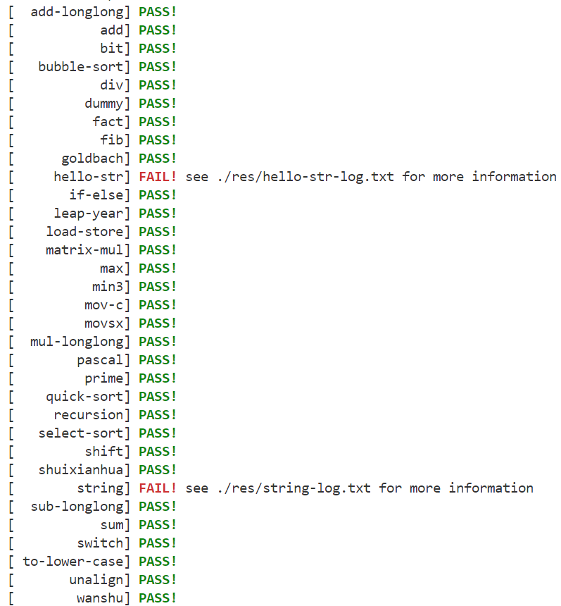

只剩下两个了！曙光近在眼前！接下来就来仔细处理这两个程序的问题。好了，又到了RFTM时间了。博主依旧是大善人，给你提取了最关键的几段话：

> 在PA中, 我们只要关注`nexus-am/libs/klib/`就可以了. `klib`是`kernel library`的意思, 用于提供一些兼容libc的基础功能. 框架代码在`nexus-am/libs/klib/src/string.c`和`nexus-am/libs/klib/src/stdio.c` 中列出了将来可能会用到的库函数, 但并没有提供相应的实现.

> ##### 实现字符串处理函数
>
> 根据需要实现`nexus-am/libs/klib/src/string.c`中列出的字符串处理函数, 让测试用例`string`可以成功运行. 关于这些库函数的具体行为, 请务必RTFM.

> ##### 实现sprintf
>
> 为了运行测试用例`hello-str`, 你还需要实现库函数`sprintf()`. 实现`nexus-am/libs/klib/src/stdio.c`中的`sprintf()`, 具体行为可以参考`man 3 printf`. 目前你只需要实现`%s`和`%d`就能通过`hello-str`的测试了, 其它功能(包括位宽, 精度等)可以在将来需要的时候再自行实现.

好了，所有的重要信息都在这里了。接下来就是搓代码时间了。`string.c`异常简单，代码甚至已经手搓过很多次，就不给了。`stdio.c`则有一些难度，不过你在最开始的时候只需要解决%s和%d就可以通过hello-str测试了。这贴出最终的代码，里面有很多东西是后面涉及的，建议你先不要全部抄下来，而是在理解的基础上自己构建代码。

```C
#include "klib.h"
#include <stdarg.h>

#if !defined(__ISA_NATIVE__) || defined(__NATIVE_USE_KLIB__)


void add_string(char **s, char *str);
void add_char(char **s, char c);
void add_number(char **s, int num,char mode);
void add_special_number(char **s, const char *fmt, va_list ap,char c);

int printf(const char *fmt, ...) {
  va_list ap;
  va_start(ap,fmt);
  char buf[1000];
  int length=vsprintf(buf,fmt,ap);
  buf[length]='\0';
  for(int i=0;i<length;i++){
    _putc(buf[i]);
  }
  va_end(ap);
  return 0;
}

int vsprintf(char *out, const char *fmt, va_list ap) {
  char *temp=out;
  while(*fmt!='\0'){
    if(*fmt=='%'){
      fmt++;
      switch(*fmt){
        case 's':{
          char *str=va_arg(ap,char*);
          add_string(&temp,str);
          break;
        }
        case 'd':{
          int num=va_arg(ap,int);
          add_number(&temp,num,'d');
          break;
        }
        case 'x':{
          int num=va_arg(ap,int);
          add_number(&temp,num,'x');
          break;
        }
        case '0':{
          fmt++;
          add_special_number(&temp,fmt,ap,'0');
          fmt++;
          break;
        }
        case '1':
        case '2':
        case '3':
        case '4':
        case '5':
        case '6':
        case '7':
        case '8':
        case '9':{
          add_special_number(&temp,fmt,ap,' ');
          fmt++;
          break;
        }
        case 'c':{
          char c=va_arg(ap,int);
          add_char(&temp,c);
          break;
        }
      }
      fmt++;
    }
    else{
      *temp++=*fmt++;
    }
  }
  *temp='\0';
  return temp-out;
}

int sprintf(char *out, const char *fmt, ...) {
  va_list ap;
  va_start(ap,fmt);
  int length=vsprintf(out,fmt,ap);
  va_end(ap);
  return length;
}

int snprintf(char *out, size_t n, const char *fmt, ...) {
  return 0;
}


void add_string(char **s, char *str) {
  while (*str!='\0') {
    **s = *str;
    (*s)++;
    str++;
  }
}

void add_char(char **s, char c) {
  **s = c;
  (*s)++;
}

void add_number(char **s, int num,char mode) {
  if (num == 0) {
    add_char(s, '0');
    return;
  }
  char temp[100];
  int i = 0;
  if(num<0){
    add_char(s,'-');
    num=-num;
  }
  if(mode=='d'){
    while (num) {
      temp[i] = num % 10 + '0';
      num /= 10;
      i++;
    }
    while (i) {
      add_char(s, temp[i - 1]);
      i--;
    }
  }
  else if(mode=='x'){
    add_string(s,"0x");
    while (num) {
      temp[i] = num % 16 + (num % 16 < 10 ? '0' : 'a' - 10);
      num /= 16;
      i++;
    }
    while (i) {
      add_char(s, temp[i - 1]);
      i--;
    }
  }
}


void add_special_number(char **s, const char *fmt, va_list ap,char c) {
  int num_of_digit=0;
  while(*fmt!='d'&&*fmt!='x'){
    num_of_digit=num_of_digit*10+*fmt-'0';
    fmt++;
  }
  int num = va_arg(ap, int);
  char temp[100];
  if(*fmt=='d'){
    int k = num==0?1:0;
    if(num<0){
      add_char(s,'-');
      num=-num;
    }
    while (num) {
      temp[k] = num % 10 + '0';
      num /= 10;
      k++;
    }
    int i=k;
    while(i<num_of_digit){
      add_char(s,c);
      i++;
    }
    while(k){
      add_char(s,temp[k-1]);
      k--;
    }
  }
  else if(*fmt=='x'){
    int k = num==0?1:0;
    while (num) {
      temp[k] = num % 16 + (num % 16 < 10 ? '0' : 'a' - 10);
      num /= 16;
      k++;
    }
    int i=k;
    while(i<num_of_digit){
      add_char(s,c);
      i++;
    }
    while(k){
      add_char(s,temp[k-1]);
      k--;
    }
  }
}

#endif
```

#### 2.2.3 测试执行

最后！再来试一下跑所有的程序：

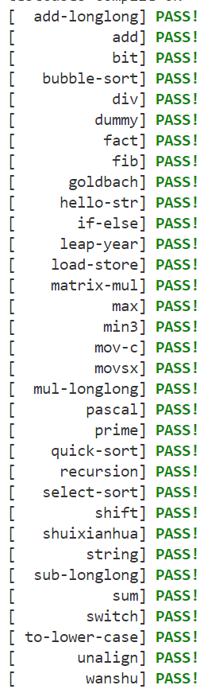

PA2.2结束！

### PA2.3 输入输出

#### 2.3.0 设备（准备工作）

修改文件，打开HAS_IOE宏定义。


> 我们提供的代码是模块化的, 要在NEMU中加入设备的功能, 你只需要在`nemu/include/common.h`中定义宏`HAS_IOE`. 定义后, `init_device()`函数会对设备进行初始化. 重新编译后, 你会看到运行NEMU时会弹出一个新窗口, 用于显示VGA的输出(见下文). 需要注意的是, 终端显示的提示符`(nemu)`仍然在等待用户输入, 此时窗口并未显示任何内容.
>
> 狠狠地仔细看这句话！认真RTFM！认真RTFM！认真RTFM！重要的事情说三遍！

#### 2.3.1 输入输出内容补充

> 注意，如果你在实现该部分内容时，同步进行了测试，那么你需要将`2.3.2`部分的相应内容同步食用，里面会有一些小tips你用得上的。

##### (1) 串口

我们的实验选择的是ISA是riscv32，因此串口部分不需要额外编写其它代码，保证前文实验内容正确的前提下就可以通过在`nexus-am/tests/amtest`目录下输入

```shell
make mainargs=h run
```

就能得到十行"hello, world"的输出了。

接下来处理`printf()`函数。

> 有了`_putc()`, 我们就可以在klib中实现`printf()`了.
>
> 你之前已经实现了`sprintf()`了, 它和`printf()`的功能非常相似, 这意味着它们之间会有不少重复的代码. 你已经见识到Copy-Paste编程习惯的坏处了, 思考一下, 如何简洁地实现它们呢?

所以，你可以轻松地搓出`printf()`函数的代码了。整个`stdio.c`的文件内容已经贴到了前面，你可以仔细查阅。

串口部分的主要工作就是这些。

##### (2) 时钟

在实现该部分内容之前，如果你有兴趣，可以先在`nexus-am/tests/amtest`目录下跑一下native的时钟：

```shell
make ARCH=native mainargs=t run
```

然后你就可以看到虚拟机的当前时间，以及每秒递增的计数。我们要做的就是用riscv32-nemu也实现这个功能。阅读手册：

> #####  实现IOE
>
> 在`nexus-am/am/src/nemu-common/nemu-timer.c`中实现`_DEVREG_TIMER_UPTIME`的功能. 在`nexus-am/am/include/nemu.h`和`nexus-am/am/include/$ISA.h` 中有一些输入输出相关的代码供你使用.

于是我们在相应的文件中可以完成如下代码的编写：

```C
#include <am.h>
#include <amdev.h>
#include <nemu.h>

static uint32_t boot_time = 0;

size_t __am_timer_read(uintptr_t reg, void *buf, size_t size) {
  switch (reg) {
    case _DEVREG_TIMER_UPTIME: {
      _DEV_TIMER_UPTIME_t *uptime = (_DEV_TIMER_UPTIME_t *)buf;
      // PA2.3 TODO: calculate time using RTC (Real Time Counter)
      uint32_t current_time = inl(RTC_ADDR);
      uptime->hi = 0;
      uptime->lo = current_time - boot_time;
      return sizeof(_DEV_TIMER_UPTIME_t);
    }
    case _DEVREG_TIMER_DATE: {
      _DEV_TIMER_DATE_t *rtc = (_DEV_TIMER_DATE_t *)buf;
      rtc->second = 0;
      rtc->minute = 0;
      rtc->hour   = 0;
      rtc->day    = 0;
      rtc->month  = 0;
      rtc->year   = 2000;
      return sizeof(_DEV_TIMER_DATE_t);
    }
  }
  return 0;
}

void __am_timer_init() {
  // PA2.3 TODO: initialize RTC
  boot_time = inl(RTC_ADDR);
}
```

时钟功能完成。

> 如果你打算现在就对你所实现的时钟功能进行测试并跑分，请注意这条提示：
>
> 跑分时请注释掉`nemu/include/common.h`中的`DEBUG`和`DIFF_TEST`宏, 以获得较为真实的跑分。

##### (3) 键盘

阅读手册：

> #####  实现IOE(2)
>
> 在`nexus-am/am/src/nemu-common/nemu-input.c`中实现`_DEVREG_INPUT_KBD`的功能. 实现后, 在`$ISA-nemu`中运行`amtest`中的`readkey test`测试. 如果你的实现正确, 在程序运行时弹出的新窗口中按下按键, 你将会看到程序输出相应的按键信息, 包括按键名, 键盘码, 以及按键状态.

很清晰地知道了需要在哪里进行编程了。我们来到对应的位置，实现相应功能。

```C
size_t __am_input_read(uintptr_t reg, void *buf, size_t size) {
  switch (reg) {
    case _DEVREG_INPUT_KBD: {
      _DEV_INPUT_KBD_t *kbd = (_DEV_INPUT_KBD_t *)buf;
      // PA2.3 TODO: implement the code to read the current state of keyboard
      int key=inl(KBD_ADDR);
      kbd->keydown = key & KEYDOWN_MASK ? 1 : 0;
      kbd->keycode = key & ~KEYDOWN_MASK;
      return sizeof(_DEV_INPUT_KBD_t);
    }
  }
  return 0;
}
```

##### (4) VGA

阅读手册，这次没有给出非常明确的要做什么的信息，但我们可以概括出来是这样：

> 1. 在`nemu/src/device/vga.c`中完善`vga_io_handler()`函数让硬件(NEMU)支持同步寄存器的使用；
> 2. 由于屏幕大小寄存器硬件已经支持，可以直接使用，同步寄存器前一步完成了支持，将这三个寄存器使用的函数进行声明；
> 3. 在`nexus-am/am/src/nemu-common/nemu-video.c`文件的`__am_vga_init()`函数中添加手册中已经编写好的代码；
> 4. 实现 `_DEVREG_VIDEO_INFO` 和 `_DEVREG_VIDEO_FBCTL` 的功能。

因此所有代码如下。

```C
// function location: nemu/src/device/vga.c
static void vga_io_handler(uint32_t offset, int len, bool is_write) {
  // TODO: call `update_screen()` when writing to the sync register
  // TODO();
    if(is_write){
    update_screen();
  }
}
```

```C
// function location: nexus-am/am/src/nemu-common/nemu-video.c

// PA2.3 added for video
void draw_sync();
int screen_width();
int screen_height();

size_t __am_video_read(uintptr_t reg, void *buf, size_t size) {
  switch (reg) {
    case _DEVREG_VIDEO_INFO: {
      _DEV_VIDEO_INFO_t *info = (_DEV_VIDEO_INFO_t *)buf;
      // PA2.3 TODO: modify the right width and height
      info->width = 400;
      info->height = 300;
      return sizeof(_DEV_VIDEO_INFO_t);
    }
  }
  return 0;
}

size_t __am_video_write(uintptr_t reg, void *buf, size_t size) {
  switch (reg) {
    case _DEVREG_VIDEO_FBCTL: {
      _DEV_VIDEO_FBCTL_t *ctl = (_DEV_VIDEO_FBCTL_t *)buf;
      // PA2.3 TODO: implement the code to write to frame buffer
      int x=ctl->x,y=ctl->y,h=ctl->h,w=ctl->w;
      int W=screen_width();
      int H=screen_height();
      uint32_t *pixels=ctl->pixels;
      uint32_t *fb=(uint32_t *)(uintptr_t)FB_ADDR;
      for(int i=0;i<h;i++){
        for(int j=0;j<w;j++){
          fb[(y+i)*W+x+j]=pixels[i*w+j];
        }
      }
      if (ctl->sync) {
        outl(SYNC_ADDR, 0);
      }
      return size;
    }
  }
  return 0;
}

// PA2.3 TODO: implement the following functions
void __am_vga_init() {
  int i;
  int size = screen_width() * screen_height();
  uint32_t *fb = (uint32_t *)(uintptr_t)FB_ADDR;
  for (i = 0; i < size; i ++) fb[i] = 0;
  draw_sync();
}
```

结束了，PA2.3的代码内容！

#### 2.3.2 测试执行

对之前实现的内容一个一个测试。

> 如果你懒得每次都打ARCH=riscv32-nemu这么多字母，你可以把`nexus-am/Makefile.check`中的`ARCH=`后面的内容改成riscv32-nemu，这样你每次就可以省去这句话了。

##### (1) 串口测试

最简单的内容，在`nexus-am/tests/amtest`直接跑：

```shell
make ARCH=riscv32-nemu mainargs=h run
```

结果如下：

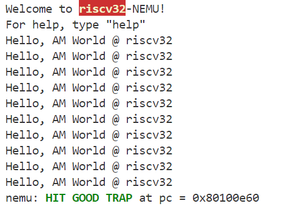

毫无技术含量，当然轻松通过了。

##### (2) 时钟测试

先来基本的，在`nexus-am/tests/amtest`直接跑：

```shell
 make ARCH=riscv32-nemu mainargs=t run
```

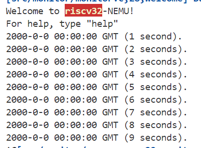

结果是这样的，没有问题。

> tips又来了！如果你前文是靠自己实现的vsprintf，又或者是你借鉴了代码但是不清楚里面除了%d和%s，多增加的一部分内容是为什么，这里将要给出解释了。
>
> 如果你只实现了%d和%s，有可能你在直接跑时钟测试的时候会输出这样的内容：
>
> 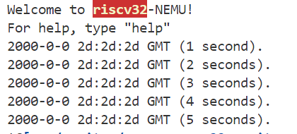
>
> 怎么回事！为什么是2d？我的00去哪里了？然后你经过RTFSC，找到了时钟部分的输出代码进行观察：
>
> ```C
>     printf("%d-%d-%d %02d:%02d:%02d GMT (", rtc.year, rtc.month, rtc.day, rtc.hour, rtc.minute, rtc.second);
> ```
>
> 哦！你恍然大悟。原来代码里多了一种神奇的格式化输出：`%02d`。你去了解了一下发现了它的含义：
>
> 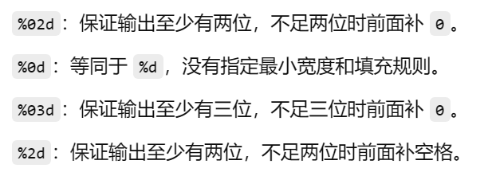
>
> 明白了。你现在需要多实现几种标准化输出了。此外同理，你还需要解决`%04x`的问题（这个问题会在你跑`coremark`程序的时候出现），聪明的你一定有办法解决它们。如果实在不清楚，就去前面看看代码吧。

时钟这一部分的内容还有几个跑分程序。逐个跑跑看。

> 再把这条提示拿过来展示一次：
>
> 跑分时请注释掉`nemu/include/common.h`中的`DEBUG`和`DIFF_TEST`宏, 以获得较为真实的跑分。

- dhrystone：

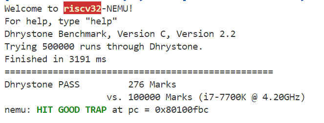

- coremark：

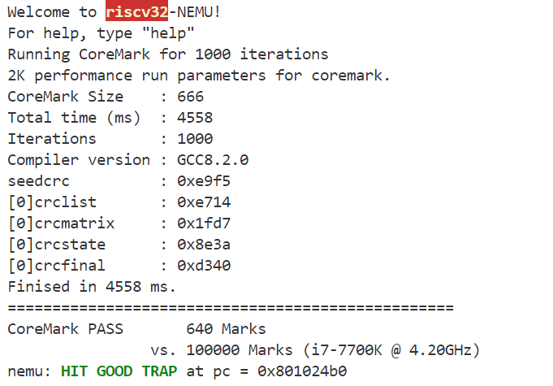

- microbench:

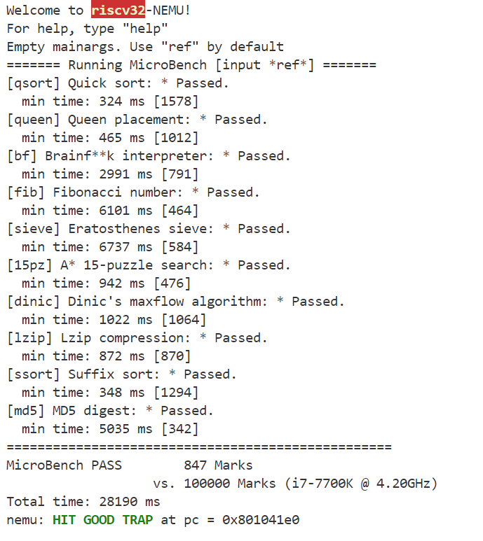

##### (3) 键盘测试

注意，从这一部分开始，由于涉及到了图形化页面，需要回到虚拟机上进行测试了。在`nexus-am/tests/amtest`直接跑：

```shell
 make ARCH=riscv32-nemu mainargs=k run
```

尝试按下HUSTPA几个键的结果如下，没有问题。


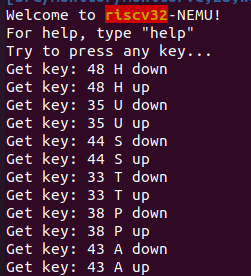

##### (4) VGA测试

一样是在虚拟机上，在`nexus-am/tests/amtest`直接跑：

```shell
make ARCH=riscv32-nemu mainargs=v run
```

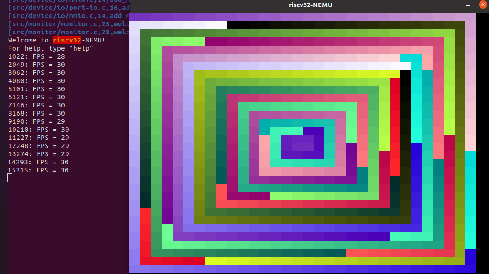

需要注意的是，窗口中呈现的应该是动画效果，如果不是，说明代码还有待完善的内容。

##### (5) “一些酷炫的程序”

你在RTFM时，注意到以下有趣的内容：

> #####  展示你的计算机系统
>
> 完整实现IOE后, 我们就可以运行一些酷炫的程序了:
>
> - 幻灯片播放(在`nexus-am/apps/slider/`目录下). 程序将每隔5秒切换`images/`目录下的图片.
> - 打字小游戏(在`nexus-am/apps/typing/`目录下). 打字小游戏来源于2013年NJUCS oslab0的框架代码. 为了配合移植, 代码的结构做了少量调整, 同时对屏幕更新进行了优化, 并去掉了浮点数.
> - 有兴趣折腾的同学可以尝试在NEMU中运行LiteNES(在`nexus-am/apps/litenes/`目录下). 没错, 我们在PA1给大家介绍的红白机模拟器, 现在也已经可以在NEMU中运行起来了!

没错，你可以玩了。前面的内容如果没问题，这里你就可以体验它们了。

+ Slider（5s自动切换幻灯片：

  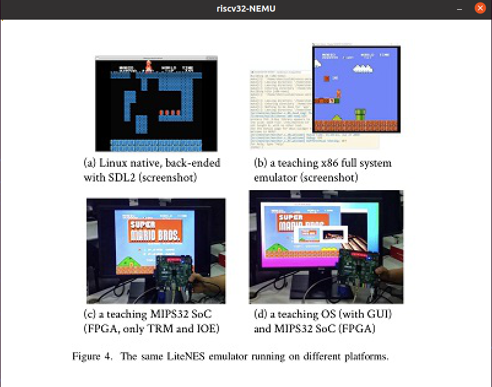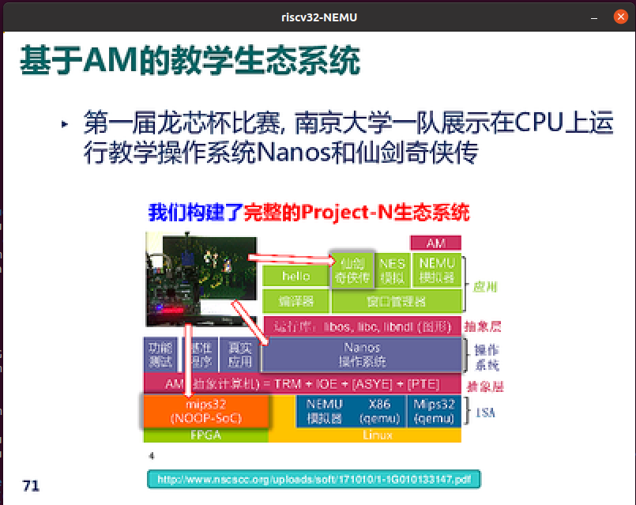

+ typing（打字小游戏，好难啊完全得不到高分）：

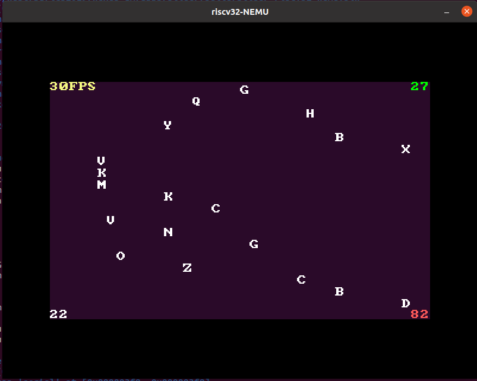

+ litenes（由于FPS太低卡成PPT）：

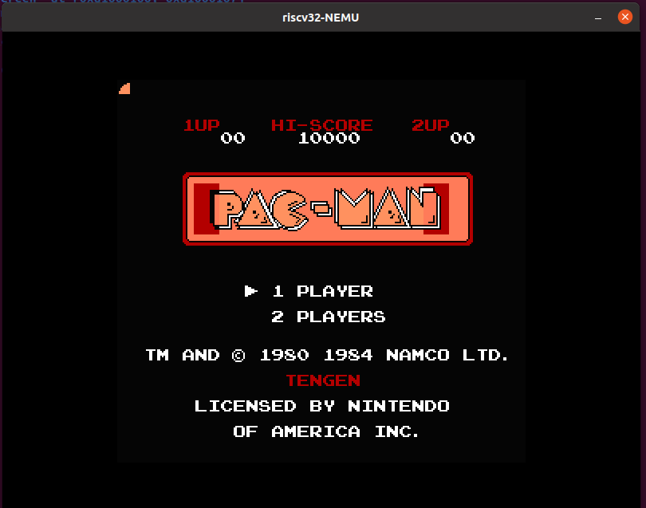

恭喜你打怪升级到了这里，圆满完成PA2！
